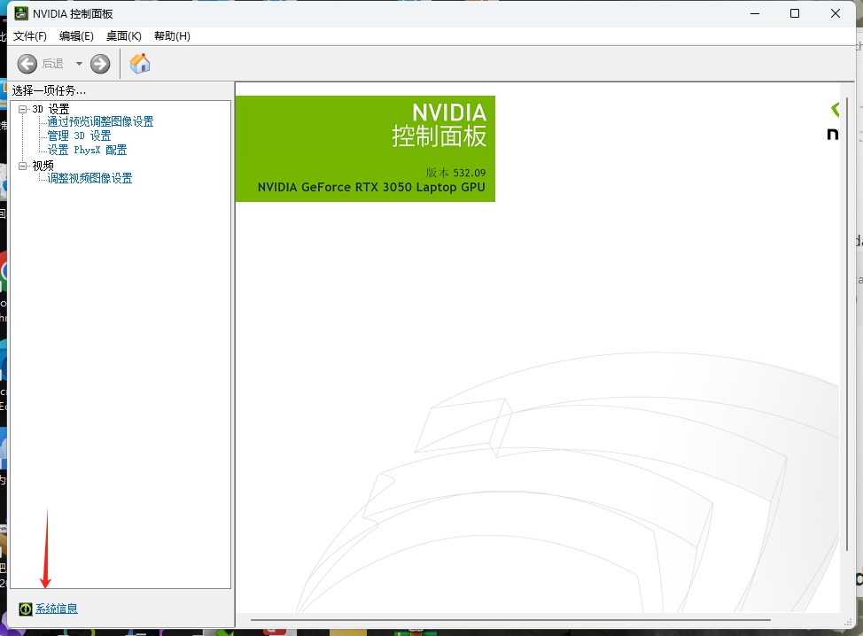
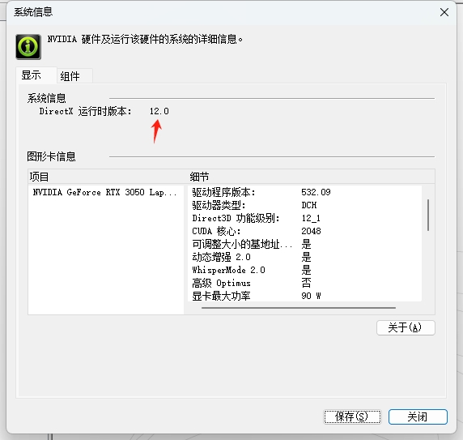

# Anaconda与pytorch的安装和配置环境 （Windows）
#Anaconda 

## 安装Anaconda

1. 与下面的图片选项一致

2. 选择Anaconda的安装路径

   **注意：安装路径选择系统盘即C盘以外的盘**

## 配置环境变量

打开控制面板

查找环境变量

选择第一个——编辑系统环境变量

![[Anaconda与pytorch的安装和配置环境/编辑系统环境变量.png]]

点击环境变量
![[Anaconda与pytorch的安装和配置环境/环境变量.png]]

点击箭头所指的 Path 进行编辑

![[Anaconda与pytorch的安装和配置环境/Path.png]]

这里我把Anaconda安在了D盘，根据自己安装路径更改

/Anaconda

/Anaconda\Scripts

/Anaconda\Library\bin
![[Anaconda与pytorch的安装和配置环境/Anaconda Path.png]]
找到下面图片中的文件位置

## 创建pytorch虚拟环境

以管理员身份打开下图程序

![[Anaconda与pytorch的安装和配置环境/Anaconda Prompt.png]]
输入下行代码

~~~ 
conda create -n pytorch python=3.9
~~~

==注意：==这里的 pytorch 只是个名字，可以输入其他进行命名；python 是 python 的版本号

输入下面这行代码进行激活pytorch

~~~ 
conda activate pytorch
~~~

激活完成后，去pytorch官网查找pytorch库的一键安装命令

将代码复制到终端进行安装pytorch库。**建议魔法上网来下载，不然容易寄**。

根据自己电脑情况进行选择

**Pytorch官网：**[Start Locally | PyTorch](https://pytorch.org/get-started/locally/)

![[Anaconda与pytorch的安装和配置环境/Pytorch.png]]
我电脑的 cuda 版本版本是 12.0，所以我使用的命令是：
~~~
conda install pytorch torchvision torchaudio pytorch-cuda=11.8 -c pytorch -c nvidia
~~~

>
>

## 在VScode中将翻译器改为pytorch

新建一个python文件

点击右下角

会出现下图

![[Anaconda与pytorch的安装和配置环境/选择环境.png]]

将其选为Python3.9.13（pythorch）

## PS：可以将虚拟环境设置为默认python路径

### 默认python环境

指添加到系统变量里的python，在cmd命令端直接执行python代码时的python环境。一般需要在系统变量里配置python环境路径如下：

### 修改默认的 python 环境

注意，得先完成上面的bu'zhou

在系统变量里将原路径改为[conda](https://so.csdn.net/so/search?q=conda&spm=1001.2101.3001.7020)创建的虚拟环境的路径：

**注意：这里的 pytorch 是虚拟环境的名字，根据自己实际情况更改**

##  [关于#python#的问题：指令内容只要需要连接网络，进行conda升级等就会出现大量DEBUG信息\_编程语言-CSDN问答](https://ask.csdn.net/questions/7990427)

**原因**

conda_build版本问题问题

**解决方法：**

这个问题实际上是由 conda_build 3.26.0. conda_build 3.25.0您可以通过降级或等待新版本的 conda_build 出现来消除问题！这将做到这一点：
~~~cmd
conda install "conda-build!=3.26.0"
~~~

