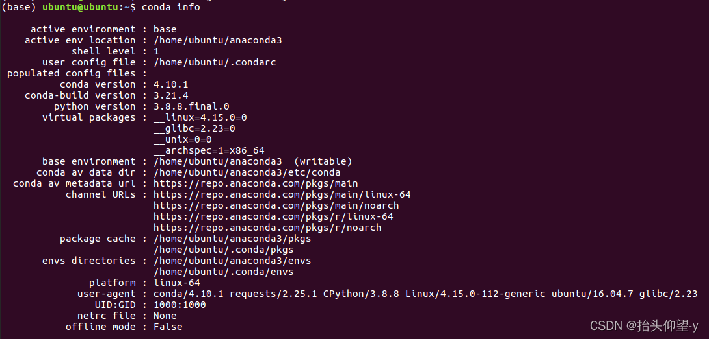
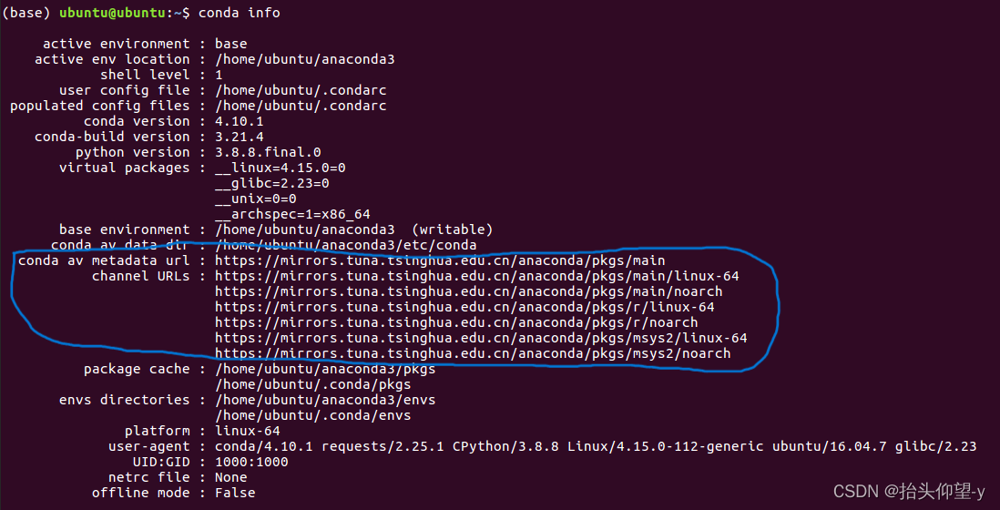

# linux 中 Anaconda 更换源
#Anaconda 

## 查看现有 Anaconda 源：

在终端中输入如下命令：
~~~cmd
conda info
~~~

返回如下图所示，可以看出**conda**默认使用的源：

## 检查 **home** 目录下有没有  _**.condarc**_  文件：

如果没有所述文件 _**. condarc**_  ，那么，执行如下命令：
~~~cmd
conda config --set show_channel_urls yes
~~~

## 打开 _**. condarc**_  ，添加如下内容：
~~~vim
default_channels:
  - https://mirrors.tuna.tsinghua.edu.cn/anaconda/pkgs/main
  - https://mirrors.tuna.tsinghua.edu.cn/anaconda/pkgs/r
  - https://mirrors.tuna.tsinghua.edu.cn/anaconda/pkgs/msys2
custom_channels:
  conda-forge: https://mirrors.tuna.tsinghua.edu.cn/anaconda/cloud
  msys2: https://mirrors.tuna.tsinghua.edu.cn/anaconda/cloud
  bioconda: https://mirrors.tuna.tsinghua.edu.cn/anaconda/cloud
  menpo: https://mirrors.tuna.tsinghua.edu.cn/anaconda/cloud
  pytorch: https://mirrors.tuna.tsinghua.edu.cn/anaconda/cloud
  pytorch-lts: https://mirrors.tuna.tsinghua.edu.cn/anaconda/cloud
  simpleitk: https://mirrors.tuna.tsinghua.edu.cn/anaconda/cloud
~~~

保存并退出

## 再次执行 `conda info `，查看 _**conda**_ 源，如下图所示，可以看到已经切换为清华源了：

## 执行如下命令来清除 conda 的缓存

~~~cmd
conda clean -i
~~~