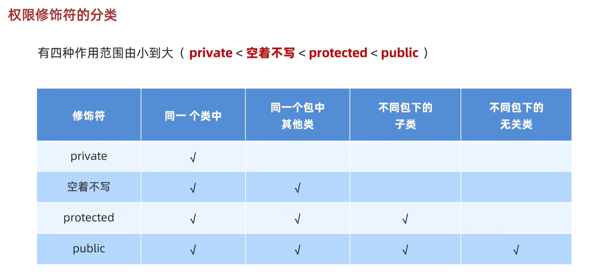
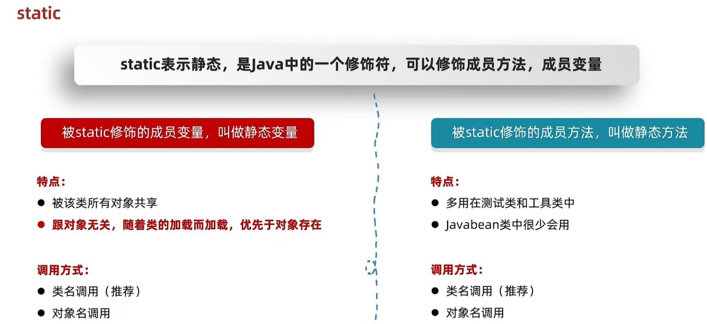
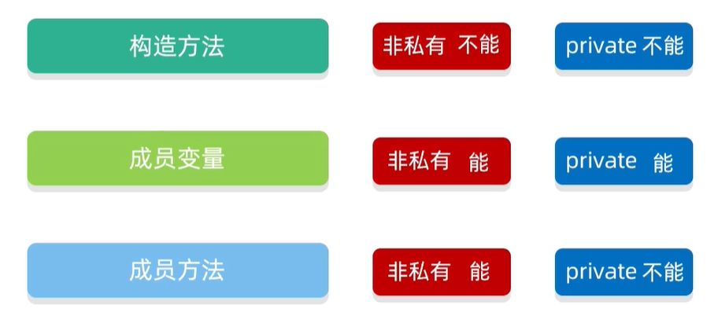
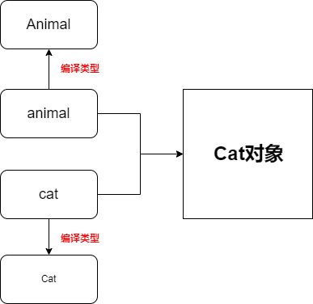
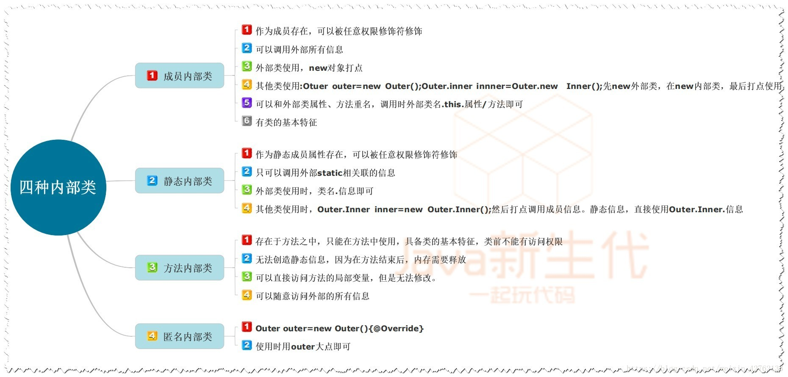

# Java 基础学习
#Java

## Java 推荐视频

>[黑马程序员Java零基础视频教程_上部](https://www.bilibili.com/video/BV17F411T7Ao/?spm_id_from=333.337.search-card.all.click)
>
>[韩顺平 零基础30天学会Java](https://www.bilibili.com/video/BV1fh411y7R8?p=1)


## IDE 常用快捷键

1. 删除当前行（自己配置）：ctrl+d
2. 不全代码：alt+/
3. 添加或取消注释：ctrl+/
4. 导入改行所需要的类 (需要到 auto import 配置)：alt+enter
5. 快速格式化 (整理代码)：ctrl+alt+L
6. 快速生成构造方法、get 和 set 方法：alt+insert
7. 查看类的层级关系：ctrl+h
8. 查看方法属于哪个类：ctrl+b
9. 自动分配变量名在类的后面加 `.var`


## 包

### 包的作用

1. 区分相同名字的类
2. 当类很多时，可以很好的管理类
3. 控制访问范围


### 包的基本语法

~~~java
package com.hspedu;
~~~

说明：

1. `package` ：关键字，表示打包
2. `com.hspedu` ： 表示包名


### 命名规则

只能包含数字、字母、下划线(_)、小圆点(.)，但不能用数字开头，不能是==关键字==或==保留字==


### 命名规范

一般是小写字母+小圆点

一般是：`com.公司名.项目名.业务模块名`

例如：

1. `com.hspedu.oa.model`

2. `comhspedu.oa.controller`

3. `com.sina.crm.user`：用户模块
4. `com.sina.crm.order`：订单模块
5. `com.sina.crm.utils`：工具类


### 如何导入包

1. 导入包中的所有类

​		语法：import 包.*;

​		例如：

~~~java
import java.util.*;
~~~

2. 导入包中的某个类

​		语法：import 包.类;

​		例如：

~~~java
import java.util.Scanner
~~~


### 注意事项和使用细节

1. `package`的作用是声明当前类所在的包，需要放在类的最上面，一个类中最多只有一个`package`

2. `import`指令位置放在`package`的下面，在类定义前面。可以有多句且没有顺序要求。


## 权限修饰符



### private(私有)


### public(公有)


## 数据类型

Java的数据类型分类两种：

1. 基本数据类型
2. 引用数据类型

### 基本数据类型

1. 数值型

   1. 整数类型，存放整数：(byte，short，int，long)
   2. 浮点(小数)类型：(float，double)

2. 字符型，存放==单个==字符。例如:`'a'`

   **注意：[[Java基础学习#String|String]] 并不是字符型，[[Java基础学习#String|String]] 是 Java 定义的类，属于引用数据类型**

3. 布尔型，存放`rue`，`false`

### 引用数据类型

1. 类(class)
2. 接口(interfce)
3. 数组([])

## 数组

### 数组介绍

数组可以存放多个同一类型的数据。数组也是一种数据类型，是==引用类型==即：数组就是一组数据

### 数组用法

#### 数组定义规则

1. 数据类型[] 数组名 = {数据}

例如：

~~~java
double[] hens = {3,5,1,3.4,2,50};
~~~


2. 数据类型[] 数组名

例如：

~~~java
double[] hens;
hens = new int[6];
~~~


3. 数据类型[] 数组名 = {数据数量}

例如：

~~~java
double[] hens = new int[6];
~~~


#### 数组使用规则

1. 可以使用下标访问数组元素。例如：hens[0]

   下标是从 0 开始编号的。第一个元素就是hens[0]，第二个元素是hens[1]

2. 通过for循环进行访问数组的元素/值

   

### 数组使用的注意事项

1. 数组是多个相同数据类型的组合，实现对这些数据的统一管理
2. 数组中的元素可以是任意的数据类型，包括基本类型和引用类型，但不能混用
3. 数组创建后，如果没有赋值，系统会赋默认值：int = 0，shor = 0 ，long = 0 ，float = 0.0，double = 0.0，char = \u0000，boolean = false，[[String]] = null
4. 数组下标必须在指定范围内使用，否则会报：下标越界异常


### 数组赋值机制

1. 基本数据类型，这个值就是具体的数据，而且相互不影响

~~~java
int n1 = 2;
int n2 = n1;
n2 = 10;
//n1=2
//n2=10
~~~

2. 数组在默认情况下是引用传递，赋的值是地址，即：arr1和arr2共用同一片内存空间

~~~java
int[] arr1 = {1,2,3};
int[] arr2 = arr1;
arr2[0]=10;
//arr1=10,2,3
//arr2=10,2,3
~~~


## 构造方法(构造器)


### 基本语法

~~~java
[修饰符] 方法名(形参列表){
	方法体；
}
~~~

1. 构造器的修饰符可以默认(default)，也可以是public、protected、private
2. 构造器==没有返回值==
3. 构造名和类名字一样
4. 参数列表和成员方法一样的规则
5. 构造器的调用由系统完成，即：**先创建好对象，再用该类的构造器完成对对象的初始化**


### 注意事项和使用细节

1. 一个类可以定义多个不同的构造器，即构造器重载

​		例如：

~~~java
public class cat {
    String name;
    int age;

    public cat(int age) {
        this.age = age;
    }

    public cat(String name) {
        this.name = name;
    }

    public cat([[String]] name, int age) {
        this.name = name;
        this.age = age;
    }
}
~~~

2. 如果没有定义构造方法，系统会自动给类生成一个默认无参构造方法(也叫默认构造器)，比如Dog(){}，可以使用==javap指令==反编译查看
2. 一旦定义了自己的构造方法，默认构造方法就覆盖了，就不能再使用默认的无参构造方法，除非自己定义一个无参构造方法

## static
### 静态
* 静态方法<span style='color:red;background:背景颜色;font-size:文字大小;font-family:字体;'>只能</span>访问静态变量和静态方法

* 非静态方法<span style='color:red;background:背景颜色;font-size:文字大小;font-family:字体;'>可以</span>访问静态变量或静态方法，<span style='color:red;background:背景颜色;font-size:文字大小;font-family:字体;'>也可以</span>访问<span style='color:blue;background:背景颜色;font-size:文字大小;font-family:字体;'>非静态</span>的成员变量和<span style='color:blue;background:背景颜色;font-size:文字大小;font-family:字体;'>非静态</span>的成员方法

* 静态方法中没有this关键字

   

**<span style='color:red;background:背景颜色;font-size:文字大小;font-family:字体;'>总结：</span>**

1. 静态方法中，只能访问静态
2. 非静态方法可以访问所有
3. 静态方法中没有this关键字





## API


​		**API是指JDK中提供的各种功能的Java类**


## 封装 


### 封装的介绍

​		封装是把抽象出来的数据==属性==和对数据的操作==方法==封装在一起，数据被保护在内部。程序的其他部分只有通过被授权的操作==方法==，才能对数据进行操作


### 封装的好处

>  [韩顺平 零基础30天学会Java](https://www.bilibili.com/video/BV1fh411y7R8?t=250.5&p=281)

1. 隐藏实现的细节

​		例如：链接数据库

​		方法(链接数据库)<==调用(传入参数)

2. 可以对数据进行验证，保证安全合理


### 封装实现的步骤

1. 将属性进行私有化(使用户不能直接修改属性，必须调用公共方法进行修改或者获取属性值)
2. 提供一个公共的`set`方法，用于对属性判断并赋值
3. 提供一个公共的`get`方法，用于获取属性的值


### 封装与构造方法


## String&String相关API


### String


#### String 原理

1. 字符串的存储原理
* 直接赋值会复用字符串常量池中的
* new出来不会复用，而是开辟一个新的空间
2. ==号比较的是什么
* 基本数据类型比较数据值
* 引用数据类型比较地址值
3. 字符串拼接的底层原理

* 当字符串拼接没有变量参与时，会从字符串常亮中取值
* 当字符串拼接有变量参与时，会创建一个StringBuilder并将变量append进容器中，再用toString变为字符串返回


#### String创建方法

1. 直接赋值

   例如：

   ~~~java
   String name = "abc";
   ~~~

​		**<span style='color:red;background:背景颜色;font-size:文字大小;font-family:字体;'>注意：</span>**当使用双引号直接赋值时，系统会检查该字符串在串池中是否存在。

​					不存在：创建新的

​					存在：复用

2. 用new关键字

   例如：

   ~~~ java
   //空参构造:可以获取一个空白的字符串对象
   String s1 = new String();
   
   //传递一个字符串，根据传递的字符串内容再创建一个新的字符串对象
   String s2 = new String("abc");
   //abc
   
   //传递一个字符数组，根据字符数组的内容再创建一个新的字符串对象
   //运用场景:修改字符串的内容。 abc->Qbc
   //abc--->{'a','b','c'}--->{'Q','b','c'}--->"Qbc"
   char[] chs = {'a','b','c','d'};
   String s3 = new String(chs);
   //abcd
   
   //传递一个字节数组，根据字节数组的内容再创建一个新的字符串对象
   //应用场景:网络当中传输的数据是字节信息
   //我们一般要把字节信息进行转换，转成字符串，此时就可以用字节数组进行构造
   byte[] bytes =  {97,98,99,100};
   String s5 = new String(bytes);
   //abcd
   ~~~


#### String的注意点

1. Strin是Java定义好的一个类。定义在java.lang包中，所以使用的时候不需要导包。
2. Java程序中的所有字符串文字都被视为此类的对象。
3. <span style='color:red;background:背景颜色;font-size:文字大小;font-family:字体;'>字符串的内容不会发生改变,它的对象在创建后不能被更改</span>


#### String比较

1. " == "

   由于 String 是引用数据类型，此时，`==` 号比较的是地址值

   ~~~java
   String s1 = "abc";
   String s2 = "abc";
   System.out.println(s1==s2);//true
   
   String s1 = new String("abc");
   String s2 = new String("abc");
   System.out.println(s1==s2);//false
   ~~~

   

2. boolean String.equals(比较字符串)方法

   ~~~java
   String s1 = new String("abc");
   String s2 = new String("abc");
   System.out.println(s1.equals(s2));//true
   
   String s1 = new String("abc");
   String s2 = new String("Abc");
   System.out.println(s1.equals(s2));//false
   ~~~

   

3. boolean String.equalsIgnoreCase(比较字符串)方法

   ~~~java
   String s1 = new String("abc");
   String s2 = new String("abc");
   System.out.println(s1.equals(s2));//true
   
   String s1 = new String("abc");
   String s2 = new String("Abc");
   System.out.println(s1.equals(s2));//true
   ~~~
   

#### Strting遍历

​		char charAt(int index):根据索引返回字符

​		int length():返回此字符串的长度

~~~java
String s1 = new String("hello");
for(int i=0;i<s1.length();i++){
    char c = str.charAt(i);
    System.out.println(c);
}
/*
h
e
l
l
o
*/
~~~

### StringBuilder

StringBuilder可以看作是一个容器，创建之后里面的内容可以改变

作用：提高字符串的操作效率

  #### StringBuilder添加元素

在StringBuilder中，我们常用append方法进行添加元素

~~~java
StringBuilder sb = new StringBuilder("abc");
sb.append("hello");
//abchello
~~~


#### StringBuilder 反转
变量名.resverse ()
举例：

~~~java
StringBuilder sb = new StringBuilder("abc");
sb.reverse();
//cba
~~~


 #### StringBuilder 的长度
 变量名. Length ()
 举例：

~~~java
StringBuilder sb = new StringBuilder("abc");
int len = sb.length();
//3
~~~


#### StringBuilder 变回 String
变量名. ToString ()
举例：

~~~java
StringBuilder sb = new StringBuilder();
sb.append("aaa");
sb.append("bbb");
sb.append("ccc");
System.out.println(sb);//aaabbbccc
String str = sb.toString();
System.out.println(str);//aaabbbccc
~~~


## extends

### 继承

* Java中提供extends，用这个关键字，我们可以让一个类和另一个类建立起继承关系

  ~~~java
  public class Student extends Person{}
  ~~~

* Student称为子类（派生类），Person成为父类（基类或超类）


### 继承的特点

* Java只支持单继承，不支持多继承，但支持多层继承

  多层继承：子类A 继承 父类B，父类B 可以继承 父类C

* Java中每一个类都直接或间接的继承于Object类

* 子类只能访问父类中非私有的成员


### 子类可以继承父类中的内容





### 继承的细节


1. 子类继承了所有的属性和方法。非私有属性和方法能在子类直接访问，但是私有属性和方法不能在子类直接访问，要通过公共的方法去访问
2. 子类必须调用父类的构造方法，完成父类的初始化
3. 当创建子类对象时，不管使用子类的哪个构造方法，默认情况下总会去调用父类的无参构造方法，如果父类没有提供无参构造方法，则必须在子类的构造方法中用super去指定父类的哪个构造方法完成对父类的初始化工作，否则，编译不会通过
4. **类是不继承父类的static变量和方法的。因为这是属于类本身的。**
5. **类中同名的static变量和方法都是相互独立的，并不存在任何的重写的关系。**
6. ==**==父类构造器的调用不限于直接父类，将向上追溯到Object类(顶级父类又称基类)


​	结论：java中静态属性和静态方法可以被继承，但是没有被重写(overwrite)而是被隐藏.

​	原因：

1. 静态方法和属性是属于类的，调用的时候直接通过  类名.方法名  完成对，不需要继承机制及可以调用。如果子类里面定义了静态方法和属性，那么这时候父类的静态方法或属性称之为"隐藏"。如果你想要调用父类的静态方法 和属性，直接通过  父类名.方法  或  父类名.变量名  完成，至于是否继承一说，子类是有继承静态方法和属性，但是跟实例方法和属性不太一样，存在"隐藏"的这种情况。
2. 多态之所以能够实现依赖于继承、接口和重写、重载（继承和重写最为关键）。有了继承和重写就可以实现父类的引用指向不同子类的对象。重写的功能是："重写"后子类的优先级要高于父类的优先级，但是“隐藏”是没有这个优先级之分的。
3. 静态属性、静态方法和非静态的属性都可以被继承和隐藏而不能被重写，因此不能实现多态，不能实现父类的引用可以指向不同子类的对象。非静态方法可以被继承和重写，因此可以实现多态。


### 什么时候用继承

当类与类之间，存在相同（共性）的内容，并满足子类是父类中的一种，就可以考虑使用继承来优化代码

## 多态

### 什么是多态

同类型的对象，表现出的不同形态


### 多态的前提

* 有继承/实现关系

* 有父类引用指向子类

* 有方法的重写

  

### 多态的好处


使用父类作为参数，可以接收所有子类对象

体现多态的扩展性与便利


### instanceof

作用：判断对象的运行类型是否为XX类型或XX类型的子类型

举例：

~~~Java
class Animal {
}

class Cat extends Animal {	 
}

Cat cat = new Cat();
System.out.println(cat instanceof Animal)//true
System.out.println(cat instanceof Cat)//true
    
Animal animal = new Cat();
System.out.println(animal instanceof Animal)//true
System.out.println(animal instanceof Cat)//true
~~~


### 多态的具体体现

1. 一个对象的编译类型和运行类型可以不一致
2. 编译类型在定义对象时，就确定了，不能改变
3. 运行类型时可以变化的
4. 编译类型看定义时 `=` 的左边，运行类型看 `=` 的右边
4. 属性看编译类型，即看 `=` 的左边

~~~java
class Animal {
    public String race = "Animal";

}
class Cat extends Animal {
	 public String race = "Cat";
}

Animal animal = new Cat();
System.out.println(animal.race)//Animal
~~~


### 多态向上引用

1. 本质：父类的引用指向了子类的对象

2. 语法：父类类型 引用名 = new 子类类型();

3. 特点：

   1. 编译类型看左边，运行类型看右边

   

   2. 可以调用父类中的所有成员（需遵守访问权限）

   ~~~Java
   class Animal {
       public String string = "Animal";
       public void eat(){
           System.out.println("动物在进食");
       }
   	
       private void test(){
           
       }
   }
   class Cat extends Animal {
       
       public void eat(){
           System.out.println("猫在进食");
       }
   
   }
   
   Animal animal = new Cat();
   System.out.println(animal.string);//Animal
   animal.test();//报错
   ~~~

   

   3. 不能调用子类中的特有成员

   ~~~java
   class Animal {
       public String string = "Animal";
       public void eat(){
           System.out.println("动物在进食");
       }
   	
       private void test(){
           
       }
   }
   class Cat extends Animal {
       
       public void eat(){
           System.out.println("猫在进食");
       }
       public void drink(){
           System.out.println("猫正在喝水");
       }
   
   }
   Animal animal = new Cat();
   animal.drink();//报错
   ~~~

   

   4. 最终运行效果子类的具体实现 

   ~~~java
   class Animal {
       public String string = "Animal";
       public void eat(){
           System.out.println("动物在进食");
       }
   	
       private void test(){
           
       }
   }
   class Cat extends Animal {
       
       public void eat(){
           System.out.println("猫在进食");
       }
       public void drink(){
           System.out.println("猫正在喝水");
       }
   
   }
   Animal animal = new Cat();
   animal.eat();//猫在进食
   ~~~

   

### 多态向下转型

1. 语法：子类类型 引用名 = (子类类型) 父类引用
2. 只能强转父类的引用，不能强转父类的对象
3. 要求父类的引用必须指向的是当前目标类型的对象

~~~Java
class Animal {
    public String string = "Animal";
    public void eat(){
        System.out.println("动物在进食");
    }
	
    private void test(){
        
    }
}
class Dog extends Animal {
    
    public void eat(){
        System.out.println("狗在进食");
    }
    public void drink(){
        System.out.println("狗正在喝水");
    }

}
class Cat extends Animal {
    
    public void eat(){
        System.out.println("猫在进食");
    }
    public void drink(){
        System.out.println("猫正在喝水");
    }

}
Animal animal = new Cat();
animal.drink();//报错
Cat cat = (Cat) animal;
cat.drink();//猫正在喝水
Dog dog = (Dog) animal;//报错
~~~



4. 可以调用子类类型中的所有成员


## Java动态绑定机制

1. 当调用对象方法的时候，该方法会和该对象的内存地址/运行类型绑定
2. 当调用对象属性时，没有动态绑定机制，哪里声明，哪里使用

举例：

~~~Java
class A {
    public int i = 10;

    public int sum() {
        return getI() + 10;
    }

    public int sum1() {
        return i + 10;
    }

    public int getI() {
        return i;
    }
}
class B extends A {
    public int i = 20;

    public int sum() {
        return i + 20;
    }

    public int sum1() {
        return i + 10;
    }

    public int getI() {
        return i;
    }

}
public class DynamicBinding {
    public static void main(String[] args) {
        A a = new B();
        System.out.println(a.i);//10
        System.out.println(a.sum());//40
        System.out.println(a.sum1());//30
        //如果将B中的sum方法注释掉，那么a.sum()==30
    }
}

~~~


## hashCode方法

1. 提高具有哈希结构的容器的效率! 
2. 两个引用，如果指向的是同一个对象，则哈希值肯定是一样的!
3. 两个引用，如果指向的是不同对象，则哈希值是不一样的
4. 哈希值主要根据地址号来的!， 不能完全将哈希值等价于地址。
5. 后面在集合，中hashCode 如果需要的话，也会重写，


## toString方法

1. 基本介绍默认返回: 全类名+@+哈希值的十六进制，(查看Object 的 toString方法）子类往往重写toString方法，用于返回对象的属性信息

~~~java
public String toString(){
	return getClass().getName()+ "@" + Interget.toHexString(hashcode());
}
//getClass().getName()的意思是：bao
~~~

2. 重写toString方法，打印对象或拼接对象时，都会自动调用该对象的toString形式
3. 当直接输出一个对象时，toString 方法会被默认的调用


## abstract

### 抽象类的作用

- 抽取共性时，无法确定方法体，就把方法体定义为抽象的。

- 强制让子类重写

- 抽象方法所在的类，必须是抽象类

- 例如：

  ~~~java
  public abstract class 类名{
      public abstract void 方法名(){
          //方法体
      }
  }
  ~~~


### 继承抽象类有哪些要注意的

- 重写抽象类中的所有抽象方法
- 继承的类是抽象类


## interface


### 接口的定义和使用

- 接口用关键字(<span style='color:red;background:背景颜色;font-size:文字大小;font-family:字体;'>interface</span>)来定义

  ~~~ java
  public interface 接口名{}
  ~~~


- 接口不能实例化

- 接口和类之间使实现关系，通过<span style='color:red;background:背景颜色;font-size:文字大小;font-family:字体;'>implements</span>关键字表示

  ~~~ java
  public class 类名 implements 接口名{}
  ~~~

- 接口的子类(实现类)

  1. 重写接口中的所有抽象方法
  2. 抽象类

  

  **<span style='color:red;background:背景颜色;font-size:文字大小;font-family:字体;'>注意：</span>**接口和类的实现关系，可以单实现，也可以多实现。

  ~~~java
  public class 类名 implements 接口名1, 接口名2{}
  ~~~

  

  

### 接口中成员的特点

* 成员变量：

  * 只能是常量

  * 默认修饰符：public static final 

    **<span style='color:red;background:背景颜色;font-size:文字大小;font-family:字体;'>注意：即使你没有自己加public static final JDK也会自己加上</span>**

* 构造方法：
  * 接口没有构造方法

* 成员方法：
  * JDK7以前：只能是抽象方法
  * JDK8以后：接口可以定义有方法体的方法
  * JDK7以后：接口可以定义私有方法
  * 默认修饰符：public abstract


### 接口和类之间的关系

* 类和类的关系
  * 继承关系，只能单继承，不能多继承，但可以多层继承
* 类和接口之间的关系
  * 实现关系，可以单实现，也可以多实现，还可以在继承一个类的痛时实现多个接口
* 接口和接口的关系
  * 继承关系，可以单继承，也可以多继承 

## 内部类

### 什么是内部类？

可以将一个类的定义放在里另一个类的内部，这就是内部类。广义上我们将内部类分为四种：成员内部类、静态内部类、局部（方法）内部类、匿名内部类。

```java
/**
*我是一个外部类（外部是相对内部而言）
*/
public class Outer{
/**
*我是一个内部类
*/
class Inner{
//...
	} 
}
```

### 为什么要用内部类？

内部类拥有类的基本特征。(eg：可以继承父类，实现接口。)在实际问题中我们会遇到一些接口无法解决或难以解决的问题，此时我们可以使用内部类继承某个具体的或抽象的类，**间接解决类无法多继承引起的一系列问题**。（注：内部类可以嵌套内部类，但是这极大的破坏了代码的结构，这里不推荐使用。）


```java
/**
 1. Outer类继承了ClassA，实现了IFunctionA
*/
public class Outer extends ClassA implements IFunctionA{ 
	/**
	*	Inner类继承了ClassB，实现了IFunctionB
	*/
	public class Inner extends ClassB implements IfunctionB{
	//
	} 
}

```



#### （一）成员内部类

##### 1、外部类、内部类
