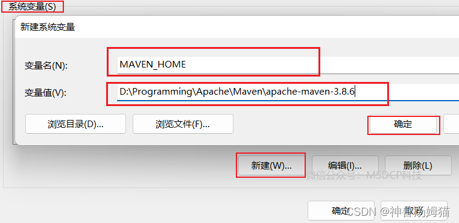
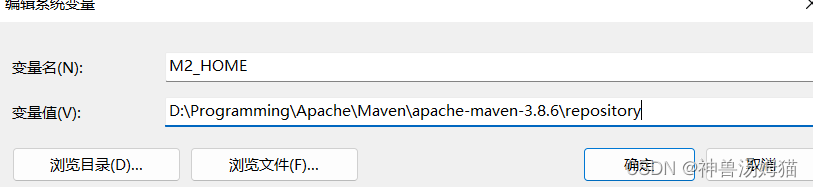

| 官网         | [Maven 官网]( https://maven.apache.org/ "Maven 官网")                                  |
| ---------- | ---------------------------------------------------------------------------------- |
| 当前最新版本下载地址 | [Maven 最新版本官网地址]( https://maven.apache.org/download.cgi "Maven 最新版本官网地址")          |
| 历史版本下载地址   | [Maven 历史版本官网地址]( https://archive.apache.org/dist/maven/maven-3/ "Maven 历史版本官网地址") |


## Windows 下安装配置 Maven

**将下载好的解压到自己设置的目录中（路径中不要有中文等影响环境的字符）**

以 `apache-maven-3.8.6-bin` 为例，在其目录内新建名为 `repository`  的文件夹，此文件夹的目的是作为本地的 Maven 仓库来使用。如图：

**配置环境变量：**

```
此电脑--->属性--->高级系统设置--->环境变量--->系统变量(S)--->新建
```

输入如下信息：

```cpp
变量名：MAVEN_HOME
变量值：D:\Programming\Apache\Maven\apache-maven-3.8.6
       //此处的变量值为你存放Maven的解压路径 
变量名：M2_HOME 
变量值：D:\Programming\Apache\Maven\apache-maven-3.8.6\repository
      //此处的变量值为你存放Maven的解压后目录中的文件夹的路径
      //很多自动依赖的系统，如springboot、springcloud引用了该地址，建议配置上
```

效果图如下图所示: 


 

继续执行如下步骤：

```
此电脑--->属性--->高级系统设置--->环境变量--->系统变量 (S)--->找到 Path 变量--->编辑--->新建
```
 
 
 输入如下信息：

```bash
%MAVEN_HOME%\bin
```

## **Maven 配置镜像**

打开 Maven 解压路径下的`conf`文件夹下的`settings.xml`文件，可以使用记事本或者 VScode 等软件打开进行编辑。

打开后在 `<mirrors></mirrors>` 标签中添加 **mirror** 子节点：

```xml
    <!-- 阿里云仓库 -->
    <mirror>
      <id>alimaven</id>
      <mirrorOf>central</mirrorOf>
      <name>aliyun maven</name>
    <url>http://maven.aliyun.com/nexus/content/repositories/central/</url>
    </mirror>
    <!-- 或者：-->
    <mirror>
      <id>nexus-aliyun</id>
      <mirrorOf>*</mirrorOf>
      <name>Nexus aliyun</name>
      <url>http://maven.aliyun.com/nexus/content/groups/public</url>
    </mirror>
```

- 虽然 mirrors 可以配置多个子节点，但它只会使用其中的一个节点，即默认情况下配置多个 mirror 的情况下，只有第一个生效，只有当前一个 mirror 无法连接的时候，才会去找后一个。
    
- 我们想要的效果是：当a.jar在第一个mirror中不存在的时候，maven会去第二个mirror中查询下载，但是maven不会这样做，所以我们尽可能的将它添加到前面。
    
- mirrors 节点下可以配置多个 mirror，每个 mirror 都有 id（是 mirror 的唯一标识）、name、url（远程仓库地址）、mirrorsOf（代表了一个镜像的替代位置，例如 central 就表示代替官方的中央库），当需要去远程仓库下载 jar 包时不是按照位置顺序来查找的，是按钮 id 的字母排序来查着的，例如当配置了 B 和 A 两个 mirror，无论这两个 mirror 的位置如何 maven 都会首先去 A 去查询，如果找到了则直接下载，如果找不到或者无法连接到 A 才会去 B 查询。这里我们在 mirrors 下新建节点，使用阿里的仓库来替换默认的远程仓库。

添加多个镜像：
可在 `<repositories></repositories>` 节点中加入对应的仓库使用地址。以使用**spring**代理仓为例：

```xml
<repository>
    <id>spring</id>
    <url>https://maven.aliyun.com/repository/spring</url>
    <releases>
        <enabled>true</enabled>
    </releases>
    <snapshots>
        <enabled>true</enabled>
    </snapshots>
</repository>
```

## **Maven 建立本地仓库：**

打开`conf`文件夹下的`settings.xml`文件，找到`settings`标签，在找到节点`localRepository`，在`注释外添加`在其中添加如下代码

（**记得将代码中路径修改为自己电脑上的本地仓库路径，即将~~D:\Programming\Apache\Maven\ apache-maven-3.8.6\repository~~改成自己的路径**）

```xml
<localRepository>D:\Programming\Apache\Maven\apache-maven-3.8.6\repository</localRepository>
```

> `localRepository` 节点用于配置本地仓库，本地仓库其实起到了一个缓存的作用，它的默认地址是 `C:\Users\用户名.m2`。当我们从 maven 中获取 jar 包的时候，maven 首先会在本地仓库中查找，如果本地仓库有则返回。如果没有则从远程仓库中获取包，并在本地库中保存。此外，我们在 maven 项目中运行 `mvn install`，项目将会自动打包并安装到本地仓库中。

## **测试 Maven**

| 运行`CMD.exe` ----> `mvn --version` --->出现 Maven 版本信息则表明成功。                                                                      |
| ------------------------------------------------------------------------------------------------------------------------------ |
| **配置完成，运行 `CMD.exe` ----> `mvn help:system` 测试，配置成功则本地仓库（D:\Programming\Apache\Maven\apache-maven-3.8.6\repository）中会出现一些文件。** |
