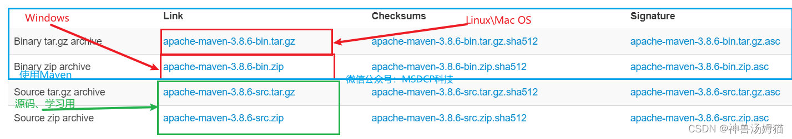

| 官网         | [Maven 官网]( https://maven.apache.org/ "Maven 官网")                                  |
| ---------- | ---------------------------------------------------------------------------------- |
| 当前最新版本下载地址 | [Maven 最新版本官网地址]( https://maven.apache.org/download.cgi "Maven 最新版本官网地址")          |
| 历史版本下载地址   | [Maven 历史版本官网地址]( https://archive.apache.org/dist/maven/maven-3/ "Maven 历史版本官网地址") |



## Windows 下安装配置 Maven

**将下载好的解压到自己设置的目录中（路径中不要有中文等影响环境的字符）**

以 `apache-maven-3.8.6-bin` 为例，在其目录内新建名为 `repository`  的文件夹，此文件夹的目的是作为本地的 Maven 仓库来使用。如图：

**配置环境变量：**

```
此电脑--->属性--->高级系统设置--->环境变量--->系统变量(S)--->新建
```

输入如下信息：

```cpp
变量名：MAVEN_HOME
变量值：D:\Programming\Apache\Maven\apache-maven-3.8.6
       //此处的变量值为你存放Maven的解压路径 
变量名：M2_HOME 
变量值：D:\Programming\Apache\Maven\apache-maven-3.8.6\repository
      //此处的变量值为你存放Maven的解压后目录中的文件夹的路径
      //很多自动依赖的系统，如springboot、springcloud引用了该地址，建议配置上
```

效果图如下图所示: 


