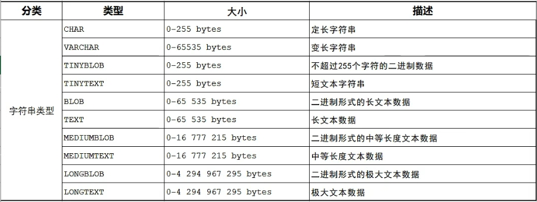

# Mysql数据库学习
#Mysql

> [SQL之母 - SQL自学网站](http://sqlmother.yupi.icu/#/learn)*一个 SQL 闯关类闯关类教学*
## SQL-DDL 语句
### SQL-数据库操作


展示有哪些数据库：
~~~sql
SHOW DATABASE;
~~~

查询当前数据库：
~~~sql
SELECT DATABASE();
~~~

创建数据库:
~~~sql
CREATE DATABASE [IF NOT EXISIS] 数据库名 [DEFAULT CHARSET 字符集][COLLATE 排序规则];
~~~

删除数据库：
~~~sql
DROP DATABASE [IF EXISTS]数据库名;
~~~

使用数据库:
~~~sql
USE 数据库名;
~~~


### SQL-DDL 表操作-查询


查询当前数据库所有表：
~~~sql
SHOW TABLES;
~~~

查询表结构
~~~sql
DESC 表名
~~~

查询指定表的建表语句
~~~sql
SHOW CREATE TALBE 表名
~~~


### SQL-DDL-表操作-创建


* TINYINT：
	* 大小：1 byte
	* 有符号范围:（-128，127）
	* 无符号范围:（ 0，255）
	* 描述：小整数值
* SMALLINT：
	* 大小：2 bytes
	* 有符号范围:（-32768，32767）
	* 无符号范围: （0，65535）
	* 描述：大整数值
* MEDIUMINT:
	* 大小：3 bytes
	* 有符号范围: (-8388608,8388607)
	* 无符号范围: (0,16777215)
	* 描述：大整数值
* INT 或或INTEGER:
	* 大小：4 bytes
	* 有符号范围: (-2147483648,2147483647)
	* 无符号范围: (0,4294967295)
	* 描述：大整数值
* BIGINT
	* 大小：8 bytes
	* 有符号范围: (-2^63，2^63-1)
	* 无符号范围: (0,2^64-1)
	* 描述：极大整数值
* FLOAT:
	* 大小：4 bytes
	* 有符号范围: (-3.402823466 E+38,34.02823466351 E+38)
	* 无符号范围: 0 和 （1.175494351 E-38,3.402823466 E+38）
	* 描述：单精度浮点数值
* DOUBLE:
	* 大小：8 bytes
	* 有符号范围: (-1.7976931348623157 E+308,1.7976931348623157 E+308)
	* 无符号范围: 0 和(2.2250738585072014 E-308,1.797693134862157 E+308)
	* 描述：小数值


* CHAR
	* 大小：0-255 bytes
	* 描述：定长字符串
* VARCHAR
	* 大小：0-65535 bytes
	* 描述：变长字符串
* TINYBLOB
	* 大小：0-255 bytes
	* 描述：不超过 255 个个字符的二进制数据
* TINYTEXT：
	* 大小：0-255 bytes
	* 描述：短文本字符串
* BLOB：
	* 大小：0-65535 bytes
	* 描述：二进制形式的长文本数据
* TEXT:
	* 大小：0-65535 bytes
	* 描述：长文本数据
* MEDIUMBLOB:
	* 大小：0-1677215 bytes
	* 描述：二进制形式的中等长度文本数据
* MEDIUMTEXT：
	* 大小：0-1677215 bytes
	* 描述：中等长度文本数据
* LONGBLOB：
	* 大小：0-4294967295 bytes
	* 描述：二进制形式的极大文本数据
* LONGTEXT:
	* 大小：0-4294967295 bytes
	* 描述：极大文本数据


* DATE 
	* 大小:3bytes
	* 范围: 1000-01-01 至 9999-12-31
	* 格式: YYYY-MM-DD
	* 描述: 日期日期值
* TIME:
	* 大小:3bytes
	* 范围: -838:59:59 至 838:59:59
	* 格式:HH:MM:SS
	* 描述: 时间值或持续时间
* YEAR
	* 大小:1bytes
	* 范围: 1901 至 2155
	* 格式:YYYY
	* 描述: 年份年份值
* DATETIME
	* 大小:8bytes
	* 范围: 1000-01-01 00:00:00 至 9999-12-31 23:59:59
	* 格式: YYYY-MM-DD HH: MM:SS
	* 描述: 混合日期混合日期和时间值
* TIMESTAMP
	* 大小:4bytes
	* 范围: 1970-01-01 00:00:01 至 2038-01-19 03:14:07
	* 格式: YYYY-MM-DD HH:MM:SS
	* 描述: 混合混合日期和时间值, 时间戳时间戳

##  DML 语句

### SQL-DML-添加数据


给指定字段添加数据
~~~sql
INSERT INTO 表名（字段名1，字段名2，...） VALUES（值1，值2,...）；
~~~

给全部字段添加数据
~~~sql
INSERT INTO 表名 VALUES (值1，值2);
~~~

批量添加数据
~~~sql
INSERT INTO 表名(字段名1，字段名2,...) VALUES(值1，值2，...),（值1，值2,...）,(值1，值2，...);
INSERT INTO 表名 VALUES(值1，值2，...),(值1，值2，...),(值1，值2,...);
~~~


### SQL-DML-修改数据


更新数据：
~~~sql
UPDATE 表名 SET 字段名 1=值1 ,字段名2=值2, ....[WHERE 条件]
~~~


### SQL-DML-删除数据


删除数据：
~~~sql
DELETE FROM 表名 [WHERE 条件]
~~~
>  修改某个字段的时候可以使用 ：
>  ` UPDATE 表名 SET 字段1 = null，,字段名2=null, ....[WHERE 条件]` 
## DQL 语句


### SQL-DQL-基本查询（SELECT）


查询多个字段：
~~~sql
SELECT 字段1,字段2,字段3,...FROM 表名;

SELECT * FROM 表名;
~~~

> [为什么不推荐使用 select * ](https://blog.csdn.net/Dome_/article/details/88583146)
> 1. 不直观，影响开发效率
> 2. 不符合开发规范

设置别名：
~~~sql
SELECT 字段1[AS 别名1],字段2[AS 别名2]... FROM 表名;
~~~

去除重复记录:
~~~sql
SELECT DISTINCT 字段列表 From 表名;
~~~

### SQL-DQL-条件查询


| 比较运算符 | 功能 |
| :--------- | ---- |
|> |大于|
|>=|大于等于|
|<|小于|
|<=|小于等于
|=|等于|
|<>或!=|不等于|
|BETWEEN...AND...|在某个范围之内 (含最大最小值)|
|IN (...)|在 in 之后之后的列表中的值, 多选一|
|LIKE 占位符|模糊匹配 (\_模糊匹配，%匹配任意个字符)|
|IS NULL|是NULL|

>_ 表示一个字符，%表示匹配任意个字符

| 逻辑运算符 |  功能 |
|-----|-----|
|AND 或&&|并且 (多个条件同时成立)|
|OR 或\|\||或者 (多个条件任意一个成立)|
|NOT 或!|非，不是|


### SQL-DQL-聚合函数


1. 介绍：
	将一列数据作为一个整体，进行纵向计算
2. 语法：
~~~sql
SELECT 聚合函数(字段列表) FROM 表名;
~~~
1. 常见聚合函数：

| 函数| 功能 |
| :------ | ------ |
|count|统计数量|
|max|最大值|
|min|最小值|
|avg|平均值|
|sum|求和|
>注意：null 值是不参与所有聚合函数运算的

### SQL-DQL-分组查询

1. 语法

```SQL
SELECT 字段列表 FROM 表名 [WHERE 条件] GROUP BY 分组字段名 [HAVING  分组后过滤条件]
```

2. where 和 having 的区别

*  执行时机不同：where 是分组之前进行过滤，不满足不满足 where 条件，不参与不参与分组；而 having 是分组之后对结果进行过滤。
* 判断条件不同： where 不能对聚合函数进行判断，而 having 可以。

**举例：**
查询年龄小于 45 的员工，并根据工作地址分组，获取员工数量大于等于 3 的工作地址
`select workaddress,count(*) from emp where age < 45 group by workaddress having count(*)>=3`

**注意：**
 1.  
当使用 `select count(*) from emp group by gender` 统计男性员工和女性员工的数量时，会出现下面这种情况

| count (\*) |
| :------ |
|7|
|9|

使用 `select gender, count(*) from emp group by gender`

|gender| count(\*) |
| :------ |------|
|女|7|
|男|9|

### SQL-DQL-排序查询

1. 语法

```sql
SELECT 字段列表 FROM 表名 ORDER BY 字段1 排序方式1 ，字段2 排序方式2
```

2. 排序方式

* ASC：升序（默认值）
* DESC：降序

**注意：** 如果是多字段排序，当第一个字段相同时，才会进行第二个字段排序

### SQL-DQL-分页查询


```sql
SELECT 字段列表 FROM 表名 LIMIT 起始索引，查询记录数;
```

**注意：** 
* 起始索引从 0 开始开始，起始索引=（查询页码 -1）\*每页显示记录数
* 分页查询是数据库的方言，不同的数据库有不同的实现，MySQL 是 LIMIT
* 如果查询的是第一页数据，起始索引可以省略，直接写成 limit 10

### 案例

1. 查询年龄为 20，21，22，23 岁的女性员工信息。
```sql
select * from emp where gender = '女' and age in(20,21,22,23);
```
2. 查询性别为男，并且且年龄在 20-40 岁（含）以内姓名为 3 个个字的员工
```sql
select * from emp where gender = '男' and age betteen 20 and 40 and name like '___'
```

```sql
select * from emp where gender = '男' and (age betteen 20 and 40) and name like '___'
```

3. 统计员工表中，年龄小于 60 岁的，男性男性员工和女性员工的人数。
```sql
select gender , count(*) from emp where age<60 group by gender
```