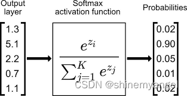

# 全连接层的作用
池化层的后面一般接着全连接层，全连接层将池化层的所有特征矩阵转化成一维的特征大向量，全连接层一般放在卷积神经网络结构中的最后，用于对图片进行分类，到了全连接层，我们的神经网络就要准备输出结果了

如下图所示，倒数第二列的向量就是全连接层的数据

从池化层到全连接层会进行池化操作，数据会进行多到少的映射，进行降维，也就是为什么上图从 20×12×12 变成 100 个神经元了，数据在慢慢减少，说明离输出结果越来越近，从全连接层到输出层会再一次减少数据，变成更加低维的向量，这个向量的维度就是需要输出的类别数。然后将这个向量的每个值转换成概率的表示，这个操作一般叫做 softmax，softmax 使得向量中每个值范围在 (0,1)之间，它是二分类函数 sigmoid 在多分类上的推广，目的是将多分类的结果以概率的形式展现出来。

因为从卷积层过来的数据太多了，全连接层的作用主要是对数据进行降维操作，不然数据骤降到输出层，可能会丢失一些图像特征的重要信息。

> [深度学习入门-卷积神经网络（一）卷积层 - 知乎](https://zhuanlan.zhihu.com/p/259751387)