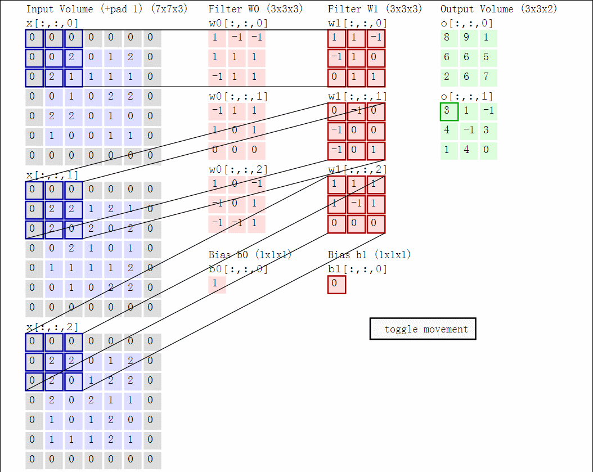

#深度学习 
# 1. 卷积层的作用

卷积层的作用是提取输入图片中的信息，这些信息被称为**图像特征**，这些特征是由图像中的每个像素通过组合或者独立的方式所体现，比如图片的纹理特征，颜色特征。

那么卷积层是如何通过运算提取图片特征的呢？

卷积操作类似于数学中的卷积，但是更加简单，计算机和我们看到的图像不一样，计算机看到的图像其实就是一个个矩阵，一系列数字，图像有几个通道就由几个矩阵相加而成的。

这里的卷积操作是通过卷积核对每个通道的矩阵从左到右（卷积核一般是 3 x 3 的矩阵）从上至下进行互相关运算（先是从左到右，再是从上至下，所以卷积操作也会保留位置信息），就像一个小的窗口一样，从左上角一步步滑动到右下角，滑动的步长是个超参数，互相关运算的意思就是对应位置相乘再相加，最后把三个通道的值也对应加起来得到一个值

图像卷积运算如下图所示：

卷积层有很多卷积核，通过做越来越多的卷积，提取到的图像特征会越来越抽象。

如下图：

.png)

卷积公式：$\frac{W-k+2p}{s}+1$

