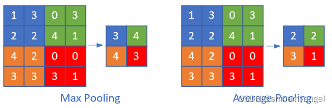
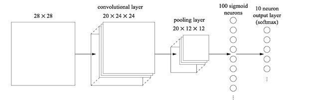
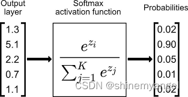

#深度学习 
# 1. 卷积层的作用

卷积层的作用是提取输入图片中的信息，这些信息被称为**图像特征**，这些特征是由图像中的每个像素通过组合或者独立的方式所体现，比如图片的纹理特征，颜色特征。

那么卷积层是如何通过运算提取图片特征的呢？

卷积操作类似于数学中的卷积，但是更加简单，计算机和我们看到的图像不一样，计算机看到的图像其实就是一个个矩阵，一系列数字，图像有几个通道就由几个矩阵相加而成的。

这里的卷积操作是通过卷积核对每个通道的矩阵从左到右（卷积核一般是 3 x 3 的矩阵）从上至下进行互相关运算（先是从左到右，再是从上至下，所以卷积操作也会保留位置信息），就像一个小的窗口一样，从左上角一步步滑动到右下角，滑动的步长是个超参数，互相关运算的意思就是对应位置相乘再相加，最后把三个通道的值也对应加起来得到一个值

图像卷积运算如下图所示：

卷积层有很多卷积核，通过做越来越多的卷积，提取到的图像特征会越来越抽象。

如下图：

.png)

卷积公式：(W-k+2p)

## 2. 池化层的作用

池化层的作用是对卷积层中提取的特征进行挑选

常见的池化操作有最大池化和平均池化，池化层是由n×n大小的矩阵窗口滑动来进行计算的，类似于卷积层，只不过不是做互相关运算，而是求n×n大小的矩阵中的最大值、平均值等。

如图，对特征图进行最大池化和平均池化操作：

池化层主要有以下几个作用：

1. 挑选不受位置干扰的图像信息。

2. 对特征进行降维，提高后续特征的感受野，也就是让池化后的一个像素对应前面图片中的一个区域。

3. 因为池化层是不进行反向传播的，而且池化层减少了特征图的变量个数，所以池化层可以减少计算量。

## 3. 全连接层的作用
池化层的后面一般接着全连接层，全连接层将池化层的所有特征矩阵转化成一维的特征大向量，全连接层一般放在卷积神经网络结构中的最后，用于对图片进行分类，到了全连接层，我们的神经网络就要准备输出结果了

如下图所示，倒数第二列的向量就是全连接层的数据

从池化层到全连接层会进行池化操作，数据会进行多到少的映射，进行降维，也就是为什么上图从 20×12×12 变成 100 个神经元了，数据在慢慢减少，说明离输出结果越来越近，从全连接层到输出层会再一次减少数据，变成更加低维的向量，这个向量的维度就是需要输出的类别数。然后将这个向量的每个值转换成概率的表示，这个操作一般叫做 softmax，softmax 使得向量中每个值范围在 (0,1)之间，它是二分类函数 sigmoid 在多分类上的推广，目的是将多分类的结果以概率的形式展现出来。

因为从卷积层过来的数据太多了，全连接层的作用主要是对数据进行降维操作，不然数据骤降到输出层，可能会丢失一些图像特征的重要信息。

>[深度学习入门-卷积神经网络（一）卷积层 - 知乎](https://zhuanlan.zhihu.com/p/259751387)
