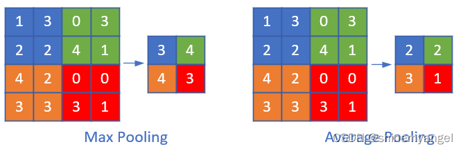

# 池化层的作用

池化层的作用是对卷积层中提取的特征进行挑选

常见的池化操作有最大池化和平均池化，池化层是由 n×n 大小的矩阵窗口滑动来进行计算的，类似于卷积层，只不过不是做互相关运算，而是求 n×n 大小的矩阵中的最大值、平均值等。

如图，对特征图进行最大池化和平均池化操作：

池化层主要有以下几个作用：

1. 挑选不受位置干扰的图像信息。

2. 对特征进行降维，提高后续特征的感受野，也就是让池化后的一个像素对应前面图片中的一个区域。

3. 因为池化层是不进行反向传播的，而且池化层减少了特征图的变量个数，所以池化层可以减少计算量。