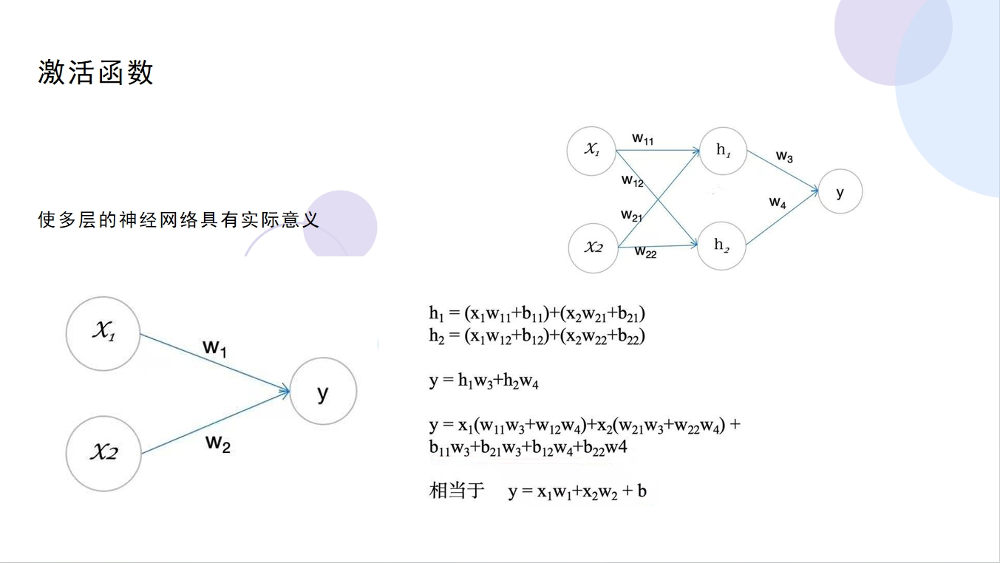

## 一、什么是激活函数？

在接触到深度学习（Deep Learning）后，特别是神经网络中，我们会发现在每一层的神经网络输出后都会使用一个函数（比如 sigmoid，tanh，Relu 等等）对结果进行运算，这个函数就是激活函数（Activation Function）。那么为什么需要添加激活函数呢？如果不添加又会产生什么问题呢？

**激活函数（Activation Function）是一种添加到人工神经网络中的函数，旨在帮助网络学习数据中的复杂模式。在神经元中，输入的 input 经过一系列加权求和后作用于另一个函数，这个函数就是这里的激活函数**。

激活函数可以分为**线性激活函数**（线性方程控制输入到输出的映射，如 f(x)=x 等）以及**非线性激活函数**（非线性方程控制输入到输出的映射，比如 Sigmoid、Tanh、ReLU、LReLU、PReLU、Swish 等）

**这里来解释下为什么要使用激活函数？**

> 因为神经网络中每一层的输入输出都是一个线性求和的过程，下一层的输出只是承接了上一层输入函数的线性变换，所以如果没有激活函数，那么无论你构造的神经网络多么复杂，有多少层，最后的输出都是输入的线性组合，纯粹的线性组合并不能够解决更为复杂的问题。而引入激活函数之后，我们会发现常见的激活函数都是非线性的，因此也会给神经元引入非线性元素，使得神经网络可以逼近其他的任何非线性函数，这样可以使得神经网络应用到更多非线性模型中。

一般来说，在神经元中，激活函数是很重要的一部分，为了增强网络的表示能力和学习能力，神经网络的激活函数都是非线性的，通常具有以下几点性质：

- 连续并可导（允许少数点上不可导），可导的激活函数可以直接利用数值优化的方法来学习网络参数；
- 激活函数及其导数要尽可能简单一些，太复杂不利于提高网络计算率；
- 激活函数的导函数值域要在一个合适的区间内，不能太大也不能太小，否则会影响训练的效率和稳定性。

## 二、常见的激活函数

### 1. Sigmoid函数

Sigmoid函数也叫Logistic函数，用于隐层神经元输出，取值范围为(0,1)，它可以将一个实数映射到(0,1)的区间，可以用来做二分类。在特征相差比较复杂或是相差不是特别大时效果比较好。sigmoid是一个十分常见的激活函数，函数的表达式如下：
$$f(x)=\frac{1}{1+e^{-x}}$$

图像类似一个S形曲线