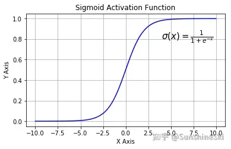
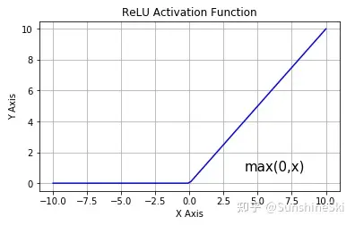

## 一、什么是激活函数？

在接触到深度学习（Deep Learning）后，特别是神经网络中，我们会发现在每一层的神经网络输出后都会使用一个函数（比如 sigmoid，tanh，Relu 等等）对结果进行运算，这个函数就是激活函数（Activation Function）。那么为什么需要添加激活函数呢？如果不添加又会产生什么问题呢？

**激活函数（Activation Function）是一种添加到人工神经网络中的函数，旨在帮助网络学习数据中的复杂模式。在神经元中，输入的 input 经过一系列加权求和后作用于另一个函数，这个函数就是这里的激活函数**。

激活函数可以分为**线性激活函数**（线性方程控制输入到输出的映射，如 f(x)=x 等）以及**非线性激活函数**（非线性方程控制输入到输出的映射，比如 Sigmoid、Tanh、ReLU、LReLU、PReLU、Swish 等）

**这里来解释下为什么要使用激活函数？**

> 因为神经网络中每一层的输入输出都是一个线性求和的过程，下一层的输出只是承接了上一层输入函数的线性变换，所以如果没有激活函数，那么无论你构造的神经网络多么复杂，有多少层，最后的输出都是输入的线性组合，纯粹的线性组合并不能够解决更为复杂的问题。而引入激活函数之后，我们会发现常见的激活函数都是非线性的，因此也会给神经元引入非线性元素，使得神经网络可以逼近其他的任何非线性函数，这样可以使得神经网络应用到更多非线性模型中。

一般来说，在神经元中，激活函数是很重要的一部分，为了增强网络的表示能力和学习能力，神经网络的激活函数都是非线性的，通常具有以下几点性质：

- 连续并可导（允许少数点上不可导），可导的激活函数可以直接利用数值优化的方法来学习网络参数；
- 激活函数及其导数要尽可能简单一些，太复杂不利于提高网络计算率；
- 激活函数的导函数值域要在一个合适的区间内，不能太大也不能太小，否则会影响训练的效率和稳定性。

## 二、常见的激活函数

### 1. Sigmoid函数

Sigmoid函数也叫Logistic函数，用于隐层神经元输出，取值范围为(0,1)，它可以将一个实数映射到(0,1)的区间，可以用来做二分类。在特征相差比较复杂或是相差不是特别大时效果比较好。sigmoid是一个十分常见的激活函数，函数的表达式如下：
$$f(x)=\frac{1}{1+e^{-x}}$$
图像类似一个 S 形曲线

**在什么情况下适合使用 Sigmoid 激活函数呢？**

- Sigmoid 函数的输出范围是 0 到 1。由于输出值限定在 0 到1，因此它对每个神经元的输出进行了归一化；
- 用于将预测概率作为输出的模型。由于概率的取值范围是 0 到 1，因此 Sigmoid 函数非常合适；
- 梯度平滑，避免「跳跃」的输出值；
- 函数是可微的。这意味着可以找到任意两个点的 sigmoid 曲线的斜率；
- 明确的预测，即非常接近 1 或 0。

**Sigmoid 激活函数存在的不足：**

- **梯度消失**：注意：Sigmoid 函数趋近 0 和 1 的时候变化率会变得平坦，也就是说，Sigmoid 的梯度趋近于 0。神经网络使用 Sigmoid 激活函数进行反向传播时，输出接近 0 或 1 的神经元其梯度趋近于 0。这些神经元叫作饱和神经元。因此，这些神经元的权重不会更新。此外，与此类神经元相连的神经元的权重也更新得很慢。该问题叫作梯度消失。因此，想象一下，如果一个大型神经网络包含 Sigmoid 神经元，而其中很多个都处于饱和状态，那么该网络无法执行反向传播。
- **不以零为中心**：Sigmoid 输出不以零为中心的,，输出恒大于0，非零中心化的输出会使得其后一层的神经元的输入发生偏置偏移（Bias Shift），并进一步使得[梯度下降](梯度下降.md)的收敛速度变慢。
- **计算成本高昂**：exp () 函数与其他非线性激活函数相比，计算成本高昂，计算机运行起来速度较慢。

### 2. Tanh/双曲正切激活函数

Tanh 激活函数又叫作双曲正切激活函数（hyperbolic tangent activation function）。与 Sigmoid 函数类似，Tanh 函数也使用真值，但 Tanh 函数将其压缩至-1 到 1 的区间内。与 Sigmoid 不同，Tanh 函数的输出以零为中心，因为区间在-1 到 1 之间。

函数表达式：

$$f(x)=\tanh (x)=\frac{e^{ x}-e^{ -x}}{e^{ x}+e^{ -x}}=\frac{2}{1+e^{-2 x}}-1$$

我们可以发现 Tanh 函数可以看作放大并平移的 Logistic 函数，其值域是(−1, 1)。Tanh 与 sigmoid 的关系如下：

$$tanh(x)=2sigmoid(2x)-1$$

tanh 激活函数的图像也是 S 形，作为一个双曲正切函数，tanh 函数和 sigmoid 函数的曲线相对相似。但是它比 sigmoid 函数更有一些优势。

你可以将 Tanh 函数想象成两个 Sigmoid 函数放在一起。在实践中，Tanh 函数的使用优先性高于 Sigmoid 函数。负数输入被当作负值，零输入值的映射接近零，正数输入被当作正值：

- 当输入较大或较小时，输出几乎是平滑的并且梯度较小，这不利于权重更新。二者的区别在于输出间隔，tanh 的输出间隔为 1，并且整个函数以 0 为中心，比 sigmoid 函数更好；
- 在 tanh 图中，负输入将被强映射为负，而零输入被映射为接近零。

**tanh存在的不足：**

- 与sigmoid类似，Tanh 函数也会有**梯度消失**的问题，因此在饱和时（x很大或很小时）也会「杀死」梯度。

注意：在一般的二元分类问题中，tanh 函数用于隐藏层，而 sigmoid 函数用于输出层，但这并不是固定的，需要根据特定问题进行调整。

### 3. ReLU激活函数

ReLU 函数又称为修正线性单元（Rectified Linear Unit），是一种分段线性函数，其弥补了 sigmoid 函数以及 tanh 函数的梯度消失问题，在目前的深度神经网络中被广泛使用。ReLU 函数本质上是一个斜坡（ramp）函数，公式及函数图像如下：
$$\begin{aligned} f(x) &=\left\{\begin{array}{ll} x & , x>=0 \\ 0 & , x<0 \end{array}\right.\\ &=\max (0, x) \end{aligned}$$
ReLU 函数是深度学习中较为流行的一种激活函数，相比于 sigmoid 函数和 tanh 函数，它具有如下优点：

- 当输入为正时，导数为1，一定程度上改善了梯度消失问题，加速[梯度下降](梯度下降.md)的收敛速度；
- 计算速度快得多。ReLU 函数中只存在线性关系，因此它的计算速度比 sigmoid 和 tanh 更快。
- 被认为具有生物学合理性（Biological Plausibility）,比如单侧抑制、宽兴奋边界（即兴奋程度可以非常高）

**ReLU函数的不足：**

- Dead ReLU 问题。当输入为负时，ReLU 完全失效，在正向传播过程中，这不是问题。有些区域很敏感，有些则不敏感。但是在反向传播过程中，如果输入负数，则梯度将完全为零；

> **【Dead ReLU问题】**ReLU神经元在训练时比较容易“死亡”。在训练时，如果参数在一次不恰当的更新后，第一个隐藏层中的某个ReLU 神经元在所有的训练数据上都不能被激活，那么这个神经元自身参数的梯度永远都会是0，在以后的训练过程中永远不能被激活。这种现象称为死亡ReLU问题，并且也有可能会发生在其他隐藏层。

- 不以零为中心：和 Sigmoid 激活函数类似，ReLU 函数的输出不以零为中心，ReLU 函数的输出为 0 或正数, 给后一层的神经网络引入偏置偏移，会影响[梯度下降](梯度下降.md)的效率。

> [深度学习笔记：如何理解激活函数？（附常用激活函数） - 知乎](https://zhuanlan.zhihu.com/p/364620596)
