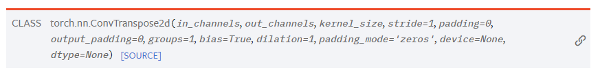
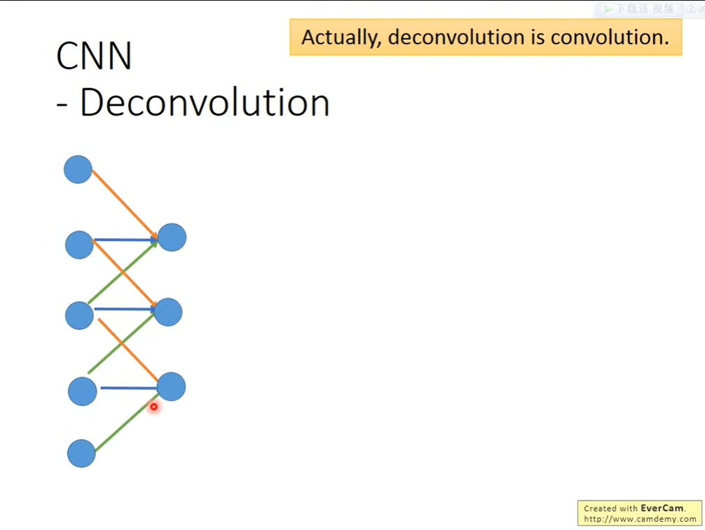
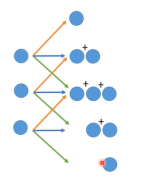
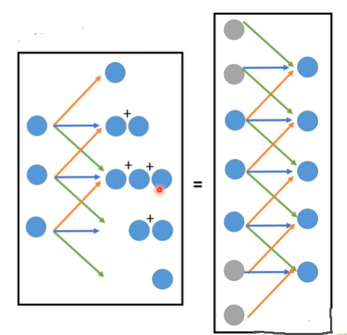

# Deconvolution(转置卷积)

 事实上，Deconvolution就是卷积(Convolution)

[ConvTranspose2d — PyTorch 2.0 documentation](https://pytorch.org/docs/stable/generated/torch.nn.ConvTranspose2d.html#torch.nn.ConvTranspose2d)

在了解什么什么是反卷积前，我们先复习一下什么是卷积

​    这里我们取一个宽度为1的数据，我们假设输入了五个数据，也就是我们现在输入了一个1x5的图片，现在，我们的卷积核的大小是1x3，我们将相邻的三个值分别乘上一个权重（weight）得到一个输出，最后我们得出一个1*3的图片

​    现在，我们开始讲反卷积

​	我们在听到反卷积的时候，第一反应是反卷积是卷积的相反，所以，Convolution时的三个值变成一个值，在做Deconvolution的时候，就应该是一个值变成三个值

​	这其实就是在做Convolution

​	现在我们在1x3的两头加上一些0，再用1x3大小的卷积核进行卷积

   
