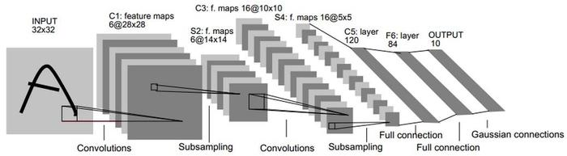

## 一、LeNet 介绍
 LeNet-5 是一个较简单的卷积神经网络。下图显示了其结构：输入的二维图像，先经过两次[卷积层](../神经网络元素/卷积层.md)到池化层，再经过全连接层，最后使用 softmax 分类作为输出层。

LeNet-5 这个网络虽然很小，但是它包含了深度学习的基本模块：[卷积层](../神经网络元素/卷积层.md)，池化层，全连接层。是其他深度学习模型的基础，这里我们对 LeNet-5 进行深入分析。同时，通过实例分析，加深对与[卷积层](../神经网络元素/卷积层.md)和池化层的理解。

LeNet-5共**有7层**，不包含输入，每层都包含可训练参数；每个层有**多个 Feature Map**，每个 FeatureMap 通过一种卷积滤波器提取输入的一种特征，然后每个 FeatureMap 有**多个神经元。**

## 各层参数详解：

#### 1、INPUT 层-输入层

首先是数据 INPUT 层，输入图像的尺寸统一归一化为32\*32。

**注意：本层不算LeNet-5的网络结构，传统上，不将输入层视为网络层次结构之一。**

#### 2、C1层-[卷积层](../神经网络元素/卷积层.md)

输入图片：32\*32

卷积核大小：5\*5

卷积核种类：6

输出 featuremap 大小：28\*28 （32-5+1）=28

神经元数量：28\*28\*6

可训练参数：（5\*5+1) \* 6（每个滤波器5\*5=25个 unit 参数和一个 bias 参数，一共6个滤波器）

连接数：（5\*5+1）\*6\*28\*28=122304

**详细说明：** 对输入图像进行第一次卷积运算（使用 6 个大小为 5\*5 的卷积核），得到6个 C1特征图（6个大小为28\*28的 feature maps, 32-5+1=28）。我们再来看看需要多少个参数，卷积核的大小为5\*5，总共就有6\*（5\*5+1）=156个参数，其中+1是表示一个核有一个 bias。对于[卷积层](../神经网络元素/卷积层.md) C1，C1内的每个像素都与输入图像中的5\*5个像素和1个 bias 有连接，所以总共有156\*28\*28=122304个连接（connection）。有122304个连接，但是我们只需要学习156个参数，主要是通过权值共享实现的。

#### 3、S2层-池化层（下采样层）

输入：28\*28

采样区域：2\*2

采样方式：4个输入相加，乘以一个可训练参数，再加上一个可训练偏置。结果通过sigmoid

采样种类：6

输出 featureMap 大小：14\*14（28/2）

神经元数量：14\*14\*6

可训练参数：2\*6（和的权+偏置）

连接数：（2\*2+1）\*6\*14\*14

S2中每个特征图的大小是C1中特征图大小的1/4。

**详细说明：** 第一次卷积之后紧接着就是池化运算，使用 2\*2核进行池化，于是得到了 S2，6个14\*14的特征图（28/2=14）。S2这个 pooling 层是对 C1中的2\*2区域内的像素求和乘以一个权值系数再加上一个偏置，然后将这个结果再做一次映射。于是每个池化核有两个训练参数，所以共有2x6=12个训练参数，但是有5x14x14x6=5880个连接。

#### 4、C3层-[卷积层](../神经网络元素/卷积层.md)

输入：S2中所有6个或者几个特征map组合

卷积核大小：5\*5

卷积核种类：16

输出 featureMap 大小：10\*10 (14-5+1=10)

C3中的每个特征map是连接到S2中的所有6个或者几个特征map的，表示本层的特征map是上一层提取到的特征map的不同组合。

存在的一个方式是：C3的前6个特征图以 S2中3个相邻的特征图子集为输入。接下来6个特征图以 S2中4个相邻特征图子集为输入。然后的3个以不相邻的4个特征图子集为输入。最后一个将 S2中所有特征图为输入。则：可训练参数：6*(3\*5\*5+1)+6*(4\*5\*5+1)+3*(4\*5\*5+1)+1*(6\*5\*5+1)=1516

连接数：10\*10\*1516=151600

**详细说明：** 第一次池化之后是第二次卷积，第二次卷积的输出是 C3，16个10x10的特征图，卷积核大小是 5*5. 我们知道 S2 有6个 14*14 的特征图，怎么从6 个特征图得到 16个特征图了？ 这里是通过对 S2 的特征图特殊组合计算得到的16个特征图。具体如下：

