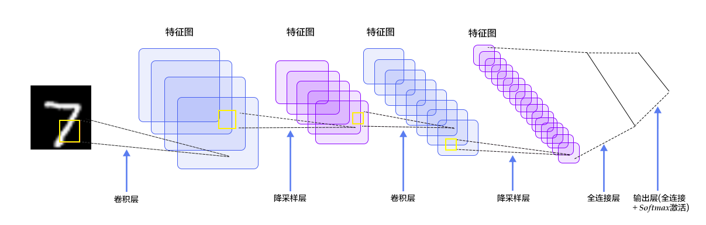
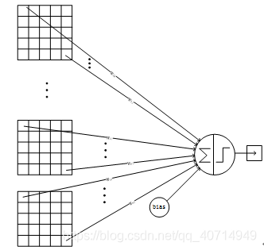

>[深度学习入门(一)：LeNet-5教程与详解\_lenet5-CSDN博客](https://blog.csdn.net/qq_40714949/article/details/109863595)
## 一、LeNet 介绍
 LeNet-5 是一个较简单的卷积神经网络。下图显示了其结构：输入的二维图像，先经过两次[卷积层](../神经网络元素/卷积层.md)到池化层，再经过全连接层，最后使用 softmax 分类作为输出层。

LeNet-5 这个网络虽然很小，但是它包含了深度学习的基本模块：[卷积层](../神经网络元素/卷积层.md)，池化层，全连接层。是其他深度学习模型的基础，这里我们对 LeNet-5 进行深入分析。同时，通过实例分析，加深对与[卷积层](../神经网络元素/卷积层.md)和池化层的理解。

LeNet-5共**有7层**，不包含输入，每层都包含可训练参数；每个层有**多个 Feature Map**，每个 FeatureMap 通过一种卷积滤波器提取输入的一种特征，然后每个 FeatureMap 有**多个神经元。**

>卷积公式：$\frac{W-k+2p}{s}+1$
## 各层参数详解：

#### 1、INPUT 层-输入层

首先是数据 INPUT 层，输入图像的尺寸统一归一化为32\*32。

**注意：本层不算LeNet-5的网络结构，传统上，不将输入层视为网络层次结构之一。**

#### 2、C1层-[卷积层](../神经网络元素/卷积层.md)

* **输入**：32 × 32 的图像

* **卷积核种类**： 6
因此[卷积层](../神经网络元素/卷积层.md) C 1 理论上能提取出输入图像 6 种不同的特征

* **卷积核大小**：5 × 5

* **输出特征图数量**： 6
每个卷积核分别与输入图像进行卷积运算，共得到 6 份输出

* **输出特征图大小**：28 × 28
从上一节举的例子中可以分析出，在没有进行填充 (padding) 的情况下，输出特征图的边长为：
**输入图像 - 卷积核 + 1**
即 32 - 5 + 1 = 28

* **神经元数量**：28 × 28 × 6
在神经网络的学习中，我们可以知道神经元其实就是一个"数"。而[卷积层](../神经网络元素/卷积层.md) C 1 是由 6 张特征图组成的，每张特征图中包含 28 × 28 个像素，一个像素其实就是一个 0 ~ 255 之间的数 (表示灰度值)，对应着一个神经元。因此共有 28 × 28 × 6 = 4704 个神经元。

* **可训练参数**：(5 × 5 + 1) × 6
首先，每个卷积核是一个 5 × 5 的矩阵，矩阵里的每个数都是要通过训练得到的；此外，在实际卷积运算后还要加上一个偏置 (bias)，因此每个卷积核需要训练 5 × 5 + 1 个参数，六个卷积核共需要训练 (5 × 5 + 1) × 6 = 156 个参数。

* **可训练参数**： *(5 × 5 + 1) × 6 = 156*
首先，每个卷积核是一个5 × 5的矩阵，矩阵里的每个数都是要通过训练得到的；此外，在实际卷积运算后还要加上一个**偏置(bias)**，因此每个卷积核需要训练5 × 5 + 1个参数，六个卷积核共需要训练(5 × 5 + 1) × 6 = 156个参数。

* **连接数**：28 × 28 × (5 × 5 + 1) × 6
 [卷积层](../神经网络元素/卷积层.md)的每个特征图的各像素都与其**对应的**卷积核的各参数间有连接。一共有 6 个这样的**特征图——卷积核**对，每个"特征图——卷积核"对包含 28 × 28 × (5 × 5 + 1) × 6 个连接，因此共有 28 × 28 × (5 × 5 + 1) × 6 = 122304 个连接。
需要注意的是，由于**权值共享机制**的存在，我们只需要训练 156 个参数。

#### 3、S2层-池化层（下采样层）

* **输入**：28\*28

* **采样区域**：2 × 2
在这里，采样方式为 4 个输入相加，乘以一个可训练参数，再加上一个可训练偏置，并将结果通过 sigmoid 函数。

* **输出特征图大小**：14 × 14

* **输出特征图数量**：6

* **神经元数量**：14 × 14 × 6
计算方法同上一节，每张特征图有 14 × 14 个像素，共 6 张，因此有 14 × 14 × 6 = 1176 个神经元。

* **可训练参数**：2 × 6
对于每张特征图，只有两个参数需要确定：用于相乘的"可训练参数"与"可训练偏置"，共 6 张特征图，因此要训练 6 × 2 = 12 个参数。

* **连接数**：14 × 14 × 6 × (2 × 2 + 1)
池化层的每个特征图的各像素都与 2×2 采样区域以及 1 个偏置有连接。因此共有 14 × 14 × 6 × (2 × 2 + 1) = 5880 个连接。

**详细说明：** 第一次卷积之后紧接着就是池化运算，使用 2 × 2 核进行池化，于是得到了 S2，6个 14 × 14 的特征图（$28\div2=14$）。S2这个 pooling 层是对 C1中的 2 × 2 区域内的像素求和乘以一个权值系数再加上一个偏置，然后将这个结果再做一次映射。于是每个池化核有两个训练参数，所以共有2x6=12个训练参数，但是有 $5 × 14 × 14 × 6=5880$ 个连接。

#### 4、C3层-[卷积层](../神经网络元素/卷积层.md)

* **输入**：14 × 14 的特征图 (6 张)
* **卷积核种类**： 16
因此[卷积层](../神经网络元素/卷积层.md) C 3 能够提取出更多细微的特征
* **卷积核大小**：5 × 5
* **输出特征图数量**： 16
(不是很重要，可以了解一下)在[卷积层](../神经网络元素/卷积层.md) C 1 中，卷积核有 6 种，而输入图像只有 1 张，因此只需要将 6 个卷积核分别对 1 张图像进行卷积操作，最后得到 6 张特征图。那么输入 6 张图像的话应该怎么处理呢？
在这里，采用的方法是"每个卷积核对多张特征图"进行处理，例如，编号为 0 的卷积核处理编号为 0、1、2 的特征图，编号为 15 的卷积核处理编号为 0、1、2、3、4、5 的特征图…具体的对应规则如下：

横轴为编号 0 ~ 15 的 16 个卷积核，纵轴为编号为 0 ~ 5 的 6 张输入特征图。一种方便的记忆方法是前 6 个卷积核处理三张连续的特征图 (对应第一个红框)，之后 6 个卷积核处理四张连续的特征图 (对应第二个红框)，之后 3 个卷积核处理四张两两连续的特征图 (对应第三个红框)，最后 1 个卷积核处理全部六张特征图 (对应最后一个红框)。

* **输出特征图大小**：10 × 10
输出特征图的边长为 14 - 5 + 1 = 10
* **可训练参数**：1516
以第一个红框为例。首先，每个卷积核包含 5 × 5 个可训练的参数；而在这里每个卷积核需要与 3 张特征图相连，最后还要加上 1 个偏置，因此需要训练 3 × 5 × 5 + 1 个参数。第一个红框内有 6 个这样的卷积核，因此共需要训练 6 × (3 × 5 × 5 + 1)个参数。
同理，对于第二个红框，其共需要训练 6 × (4 × 5 × 5 + 1)个参数；对于第三个红框，其共需要训练 3 × (4 × 5 × 5 + 1)个参数；对于第四个红框，其共需要训练 1 × (6 × 5 × 5 + 1)个参数。
总计可训练 6 × (3 × 5 × 5 + 1) + 6 × (4 × 5 × 5 + 1) + 3 × (4 × 5 × 5 + 1) + 1 × (6 × 5 × 5 + 1) = 1516 个参数。

* **连接数**：10 × 10 × 1516
[卷积层](../神经网络元素/卷积层.md)的每个特征图的各像素都与其对应的卷积核的各参数间有连接。因此共有 10 × 10 × 1516 = 151600 个连接。

[卷积层](../神经网络元素/卷积层.md) C3采用这种卷积核-特征图组合方式的好处有：

- 减少参数
- 有利于提取多种组合特征 (因为组合方式并不对称)

### 池化层 S4
* **输入**：·10 × 10 的特征图 (16 张)
* **采样区域**： 2 × 2
在这里，采样方式为 4 个输入相加，乘以一个可训练参数，再加上一个可训练偏置，并将结果通过 sigmoid 函数。
* **输出特征图大小**：5 × 5
* **输出特征图数量**：16
* **神经元数量**：5 × 5 × 16
每张特征图有 5 × 5 个像素，共 16 张，因此有 5× 5 × 16 = 400 个神经元。
* **可训练参数**：2 × 16
对于每张特征图，只有两个参数需要确定：用于相乘的"可训练参数"与"可训练偏置"，共 16 张特征图，因此要训练 16 × 2 = 32 个参数。
* **连接数**：5 × 5 × 16 × (2 × 2 + 1)
池化层的每个特征图的各像素都与 2×2 采样区域以及 1 个偏置有连接。因此共有 5 × 5 × 16 × (2 × 2 + 1) = 2000 个连接。

##### [卷积层](../神经网络元素/卷积层.md) C5

- **输入**：5 × 5的特征图(16张)

- **卷积核种类** ：120

- **卷积核大小**：5 × 5

- **输出**：120维向量

- **算法：**  
 每个卷积核与 16 张特征图做卷积，得到的结果求和，再加上一个偏置，结果通过 sigmoid 函数输出。
 
 - **可训练参数：**(5 x 5 x 16 + 1) x 120  
对于每个卷积核，其要与16张特征图的每个像素以及偏置相连，共120个卷积核，因此要训练的参数为(5 x 5 x 16 + 1) x 120 = 48120。

### 全连接层 F6
* **输入**：120 维向量
* **算法**： 计算输入向量和权重向量之间的点积，再加上一个偏置，结果通过 sigmoid 函数输出。
* **输出**：84 维向量
* **可训练参数**：84 × (120 + 1)
对于 F 6 层的每个结点，其值是由输入向量与权重向量做点积得到的，而由于权重向量与输入向量的维度相同，因此权重向量也是 120 维的，需要训练 120 个参数，加上偏置，每个结点需要训练 121 个参数。一共有 84 个结点，因此需要训练 84 × 121 = 10164 个参数。

##### 全连接层 OUTPUT

- **输入**：84维向量  
本质上是一张7×12的比特图，表示经过我们多层处理最终得到的一张"数字图像"。
- **输出**：10维向量  
 OUTPUT层共有10个结点y0、y1、…、y9，分别对应着数字0到9。
>*其实输出就是类别数*

