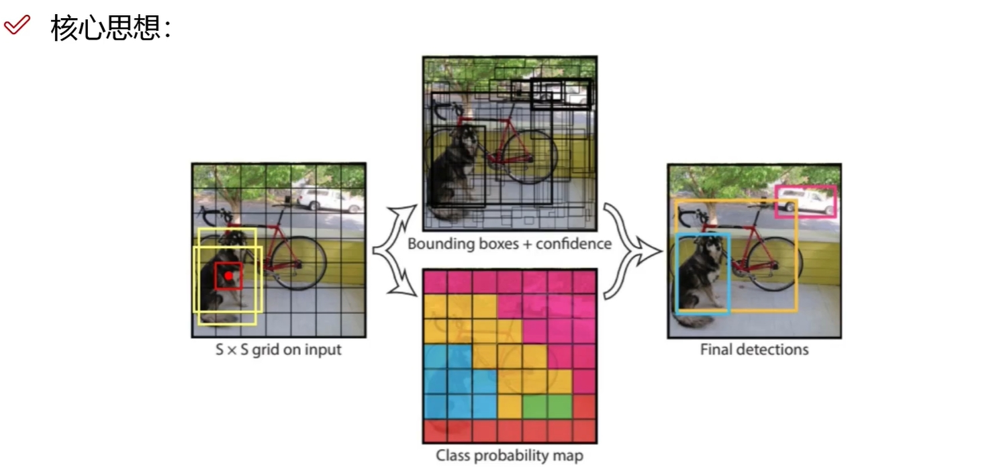
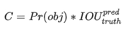
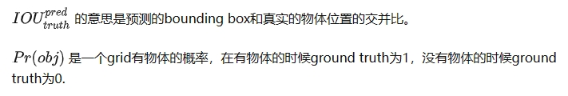
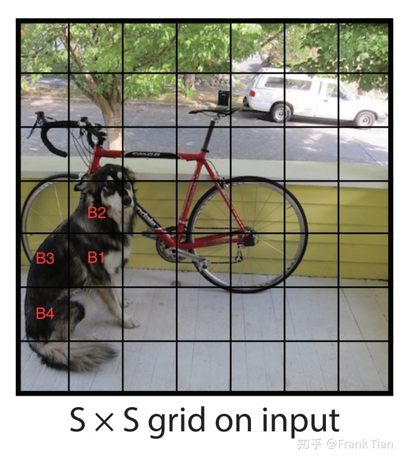

#深度学习 

## YOLO 是什么？

YOLO是目标检测模型。

目标检测是计算机视觉中比较简单的任务，用来在一张图篇中找到**某些特定的物体**，目标检测不仅要求我们识别这些物体的**种类**，同时要求我们标出这些物体的**位置**。

显然，类别是离散数据，位置是连续数据。

上面的图片中，分别是计算机视觉的三类任务：分类，目标检测，实例分割。

很显然，整体上这三类任务从易到难，我们要讨论的目标检测位于中间。前面的分类任务是我们做**目标检测的基础**，至于**像素级别**的实例分割，太难了别想了。

## YOLO 原理

我们的目的是在一张图片中找出物体，并给出它的类别和位置。目标检测是基于监督学习的，每张图片的监督信息是它所包含的 N 个物体，每个物体的信息有**五个**，分别是物体的**中心位置(x,y)**和它的**高(h)**和**宽(w)**，最后是它的类别**。
YOLO 的第一步是**分割图片**，它将图片分割为 S2 **(一般来说,S2)** 个 grid，每个 grid 的大小都是相等的

我们要让这个 S2 个框每个都预测出 **B 个 bounding box**，这个 bounding box 有5个量，分别是物体的 **中心位置(x,y)** 和它的 **高(h)** 和 **宽(w)**，以及这次预测的 **置信度**。

每个框框不仅只预测B个bounding box，它还要负责预测这个框框中的物体**是什么类别**的，这里的类别用one-hot编码表示。

注意，虽然一个框框有多个bounding boxes，但是只能识别出一个物体，因此每个框框需要预测物体的类别，**而bounding box不需要**。

也就是说，如果我们有 S2 个框框，每个框框的 bounding boxes 个数为 B，分类器可以识别出 C 种不同的物体，那么所有整个 ground truth 的长度为：
## bounding box

bounding box 可以锁定物体的位置，这要求它输出四个关于位置的值，分别是 x,y,h 和 w。我们在处理输入的图片的时候想让图片的大小**任意**，这一点对于卷积神经网络来说不算太难，但是，如果输出的位置坐标是一个**任意的正实数**，模型很可能在**大小不同**的物体上**泛化能力**有很大的差异。

这时候当然有一个常见的套路，就是对数据进行归一化，让连续数据的值位于0和1之间。

对于x和y而言，这相对比较容易，毕竟x和y是物体的中心位置，既然物体的中心位置在这个grid之中，那么只要让真实的**x除以grid的宽度**，让真实的**y除以grid的高度**就可以了。

但是h和w就不能这么做了，因为一个物体很可能远大于grid的大小，预测物体的高和宽很可能大于bounding box的高和宽，这样w除以bounding box的宽度，h除以bounding box的高度依旧**不在0和1之间**。

解决方法是让**w除以整张图片的宽度**，**h除以整张图片的高度**。

下面的例子是一个448*448的图片，有3*3的 grid，展示了计算 x,y,w,h 的真实值（ground truth）的过程：

## IOU 指标

IoU是一种测量在特定数据集中检测相应物体准确度的一个标准。IoU是一个简单的测量标准，只要是在输出中得出一个预测范围(bounding boxex)的任务都可以用IoU来进行测量。为了可以使IoU用于测量任意大小形状的物体检测，我们需要：

* ground-truth bounding boxes（人为在训练集图像中标出要检测物体的大概范围）
* 我们的算法得出的结果范围。
也就是说，这个标准用于测量真实和预测之间的相关度，相关度越高，该值越高。

**IoU 是两个区域重叠的部分除以两个区域的集合部分得出的结果，通过设定的阈值，与这个 IoU 计算结果比较。**

## confidence
confidence 的计算公式是：

这个**IOU** 非常有意思，因为它的 groun truth 不是确定的，这导致虽然 **Pr** 的 ground truth 是确定的，但是 bounding box 的 confidence 的 ground truth 是不确定的。
一个不确定的 ground truth 有什么用呢？

想象这样的问题：老师问小明1+1等于几。小明说等于2，老师又问你有多大的把握你的回答是对的，小明说有80%

这里的80%就是confidence。

confidence 主要有两个作用
* 是用来极大值抑制
* 就是在最后输出结果的时候，将某个 bounding box 的 confidencd 和这个 bounding box 所属的 grid 的类别概率相乘，然后输出。
## 非极大值抑制

现在我们可以让每个grid找到负责的物体，并把它识别出来了。但是还存在一个不得不考虑的问题，如果物体很大，而框框又很小，一个物体被多个框框识别了怎么办？
这里，我们要用到一个叫做**非极大值抑制**Non-maximal suppression(NMS)的技术。
这个 NMS 还是基于交并比实现的。

例如在上面狗狗的图里，B1,B2,B3,B4这四个框框可能都说狗狗在我的框里，但是最后的输出应该只有一个框，那怎么把其他框删除呢？

这里就用到了我们之前讲的confidence了，confidence预测**有多大的把握这个物体在我的框里**，我们在同样是检测狗狗的框里，也就是B1,B2,B3,B4中，选择confidence最大的，把其余的都删掉。

也就是只保留B1.

但是这里还有一个引人深思的问题，为什么 confidence 的定义是  ，直接用 **Pr** 不行吗，直接用 **Pr** 的话就可以把 ground truth 确定下来，训练的时候就方便多了。

这里有一个非常非常鸡贼的技巧！

理论上只用 **Pr** 也可以选出应该负责识别物体的 grid，但是可能会**不太精确**。这里我们训练的目标是预测 **Pr * IOU** ，我们的想法是让本来不应该预测物体的 grid 的 confidence 尽可能的小，既然 **Pr** 的效果不太理想，那我就让 **IOU** **尽可能小**。

为什么**真正的最中间的grid**的confidence往往会比较大呢？

因为我们的bounding boxes是用**中点坐标+宽高**表示的，每个grid预测的bounding box都要求其中心在这个grid内，那么如果不是最中间的grid，其他的grid的**IOU自然而言就会比较低**了，因此相应的confidence就降下来了。

现在，我们知道了哪个是应该保留的bounding boxes了，但是还有一个问题，我们是怎么判断出这几个bounding boxes**识别的是同一个物体**的呢？

这里用到NMS的技巧，我们首先判断这几个grid的类别是不是相同的，假设上面的B1，B2，B3和B4识别的都是狗狗，那么进入下一步，我们保留B1，然后判断B2，B3和B4要不要删除。

我们把B1成为**极大bounding box**，计算极大bounding box和其他几个bounding box的IOU，如果超过一个阈值，例如0.5，就认为这**两个bounding box实际上预测的是同一个物体**，就把其中**confidence比较小**的删除。

最后，我们结合极大bounding box和grid识别的种类，判断图片中有什么物体，它们分别是什么，它们分别在哪。
