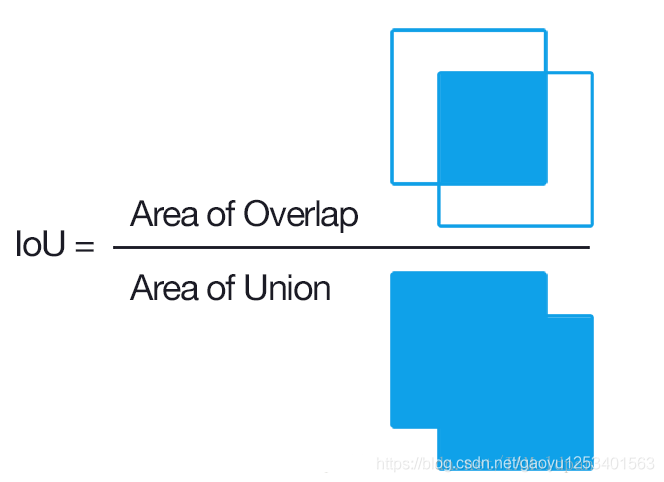

#深度学习 

## YOLO 是什么？

YOLO是目标检测模型。

目标检测是计算机视觉中比较简单的任务，用来在一张图篇中找到**某些特定的物体**，目标检测不仅要求我们识别这些物体的**种类**，同时要求我们标出这些物体的**位置**。

显然，类别是离散数据，位置是连续数据。

上面的图片中，分别是计算机视觉的三类任务：分类，目标检测，实例分割。

很显然，整体上这三类任务从易到难，我们要讨论的目标检测位于中间。前面的分类任务是我们做**目标检测的基础**，至于**像素级别**的实例分割，太难了别想了。

## YOLO 原理

我们的目的是在一张图片中找出物体，并给出它的类别和位置。目标检测是基于监督学习的，每张图片的监督信息是它所包含的 N 个物体，每个物体的信息有**五个**，分别是物体的**中心位置(x,y)**和它的**高(h)**和**宽(w)**，最后是它的类别**。
YOLO 的第一步是**分割图片**，它将图片分割为 S2 **(一般来说,S2)** 个 grid，每个 grid 的大小都是相等的

我们要让这个 S2 个框每个都预测出 **B 个 bounding box**，这个 bounding box 有5个量，分别是物体的 **中心位置(x,y)** 和它的 **高(h)** 和 **宽(w)**，以及这次预测的 **置信度**。

每个框框不仅只预测B个bounding box，它还要负责预测这个框框中的物体**是什么类别**的，这里的类别用one-hot编码表示。

注意，虽然一个框框有多个bounding boxes，但是只能识别出一个物体，因此每个框框需要预测物体的类别，**而bounding box不需要**。

也就是说，如果我们有 S2 个框框，每个框框的 bounding boxes 个数为 B，分类器可以识别出 C 种不同的物体，那么所有整个 ground truth 的长度为：
## bounding box

bounding box 可以锁定物体的位置，这要求它输出四个关于位置的值，分别是 x,y,h 和 w。我们在处理输入的图片的时候想让图片的大小**任意**，这一点对于卷积神经网络来说不算太难，但是，如果输出的位置坐标是一个**任意的正实数**，模型很可能在**大小不同**的物体上**泛化能力**有很大的差异。

这时候当然有一个常见的套路，就是对数据进行归一化，让连续数据的值位于0和1之间。

对于x和y而言，这相对比较容易，毕竟x和y是物体的中心位置，既然物体的中心位置在这个grid之中，那么只要让真实的**x除以grid的宽度**，让真实的**y除以grid的高度**就可以了。

但是h和w就不能这么做了，因为一个物体很可能远大于grid的大小，预测物体的高和宽很可能大于bounding box的高和宽，这样w除以bounding box的宽度，h除以bounding box的高度依旧**不在0和1之间**。

解决方法是让**w除以整张图片的宽度**，**h除以整张图片的高度**。

下面的例子是一个448*448的图片，有3*3的 grid，展示了计算 x,y,w,h 的真实值（ground truth）的过程：

## IOU 指标

      IoU是一种测量在特定数据集中检测相应物体准确度的一个标准。IoU是一个简单的测量标准，只要是在输出中得出一个预测范围(bounding boxex)的任务都可以用IoU来进行测量。为了可以使IoU用于测量任意大小形状的物体检测，我们需要：

* ground-truth bounding boxes（人为在训练集图像中标出要检测物体的大概范围）
我们的算法得出的结果范围。
       也就是说，这个标准用于测量真实和预测之间的相关度，相关度越高，该值越高。

**IoU 是两个区域重叠的部分除以两个区域的集合部分得出的结果，通过设定的阈值，与这个 IoU 计算结果比较。**

