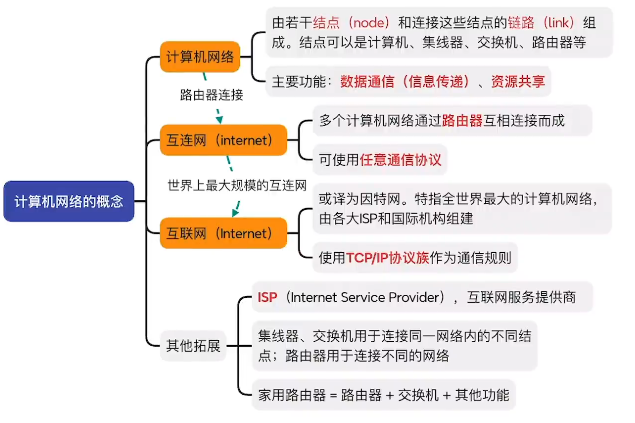
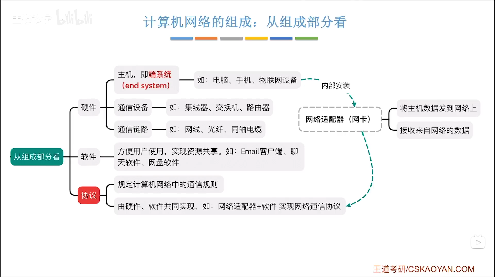
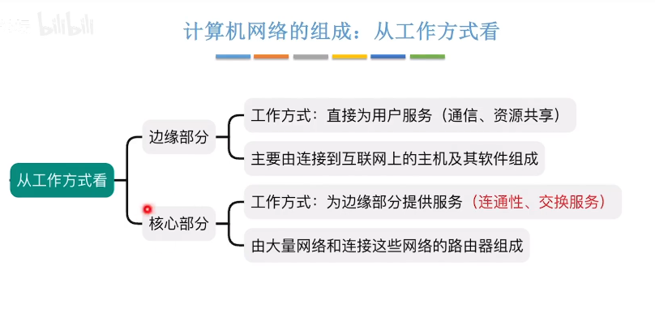
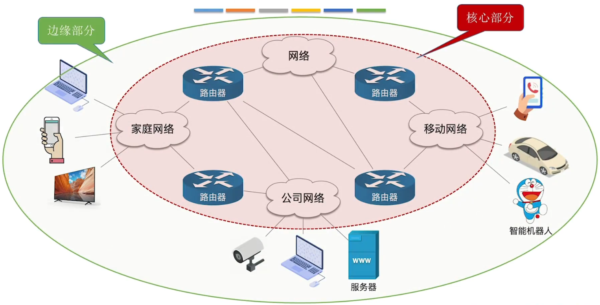
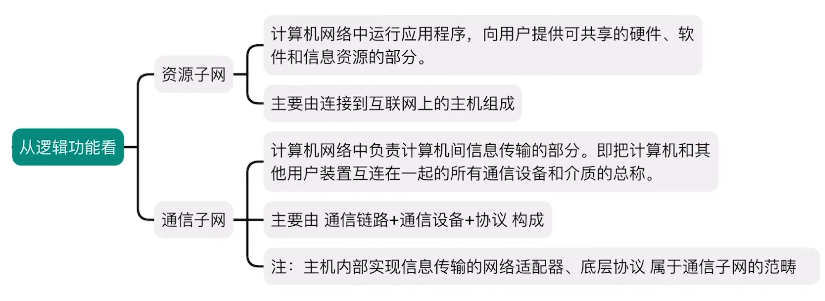
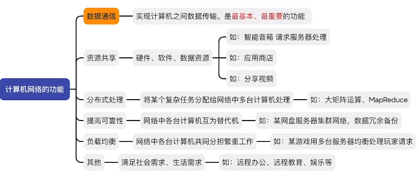
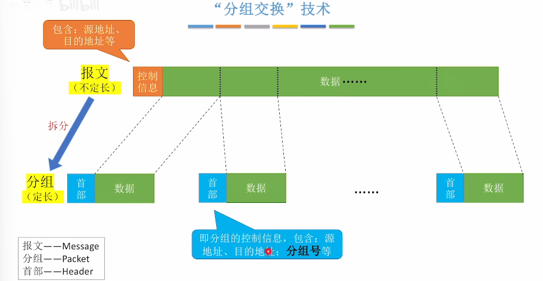

#计算机网络
# 计算机网络的概念

## 计算机网络

1. 由若干**节点**和连接这些节点的**链路**组成。节点可以是计算机、集线器、交换机等
2. 主要功能：**数据通信 (信息传递)、资源共享**

## 互连网（个人理解为内网）

1. 多个计算机网络通过**路由器**相互连接而成
2. 可以使用**任意通信协议**

## 互联网（个人理解为公网）

1. 特指全世界最大的计算机网络，由各大 ISP 和国际机构组成
2. 使用**TCP/IP 协议族**作为通信规则

## 其他拓展

1. **ISP**，互连网服务提供商。如：电信，联通等
2. 集线器，交换机用于连接同一网络内的不同节点；路由器用于连接不同的网络（注：目前集线器较少使用，因为会产生数据冲突，交换机可以避免这种情况）
3. **家用路由器=路由器+交换机+其他功能**

# 计算机网络的组成和功能

## 由组成部分来看

### 1. 硬件 

#### (1) 主机（端系统）

如：电脑、手机、物联网设备

####  (2) 通信设备

如：集线器、交换机、路由器

#### (3）通信链路

如：网线、光纤、同轴线缆

### 2. 软件

方便用户的使用，实现资源共享。

如：Email 客户端，聊天软件，网盘软件

### 3. 协议

**规定计算机网络中的通信规则，由硬件、软件共同实现**

如：网络适配器+软件实现实现网络通信协议

### 4. 网络适配器(网卡)

1. 将主机数据发送到网络上
2. 接收来自网络的数据

## 从工作方式来看

### 边缘部分

1. 工作方式：直接为用户服务 (通信、资源共享)
2. 主要由连接到互连网上的**主机以及其软件组成**

### 核心部分

1. 工作方式：为边缘部分提供服务 **(连通性、交换服务)**
2. 由大量网络和连接这些网络的**路由器**组成

## 从逻辑功能看

### 资源子网

1. 计算机网络运行应用程序，向用户提供可共享的硬件、软件和信息资源的部分。
2. 主要由连接到互联网上的主机组成

### 通信子网

1. 计算机网络中负责计算计算机信息传输的部分。即把计算机和其他用户装置互连在一起的所有通信设备和介质的的总称。
2. 主要由**通信链路+通信设备+协议**构成
3. 注：主机内部实现信息传输的**网络适配器、底层协议**属于通信子网的范畴

## 计算机网络的功能

### 数据通信

实现计算机之间数据传输。是**最基本、最重要**的功能。当该功能无法实现时，其他功能都无法实现。

### 资源共享

硬件、软件、数据资源的共享

硬件资源共享，如：智能音箱请求请求服务器处理
软件资源共享，如：应用商店
数据资源共享，如：分享视频

### 分布式处理

将某个复杂任务分配给网络中多台计算机处理

如：大矩阵运算

### 提高可靠性

网络中多台计算机互为替代机

如：某网盘服务器集群网络，数据冗余备份

### 负载均衡

网络中各台计算机共同分担繁重工作

如：某游戏用多台服务器均衡处理玩家请求

### 其他

满足社会需求、生活需求

如：远程办公、远程教育、娱乐等

# 电路交换、报文交换、分组交换

## 电路交换

通过物理线路的连接，动态地分配传输线路资源

### 电路交换的优点

* 通信前从主叫端建立一条**专用的物理通路**，在通信的全部时间内，两个用户**始终占用**端到端的**线路资源**。数据直送，传输速率高

### 电路交换的缺点

* 建立/释放连接，需要**额外的时间开销**。
* 线路被通信双方**独占，利用率低**
* 线路分配的**灵活性差**
* 交换节点**不支持差错控制**（无法发现传输过程中发生的数据错误）

总结：电路交换不适用于计算机之间的通信
原因：
1. 电路交换需要建立/释放连接，造成额外的时间开销。而计算机之间的数据往往是突发式传输的，即往往会高频次，少量地传输数据
2. 线路被双方独占，无法共享。

## 报文交换

在数据首部增加控制信息，根据控制信息将传输的数据单元先存储进中间节点，再根据目的地址转发至下一节点

### 报文交换的优点

* 通信前无需建立连接
* 数据以报文为单位被交换节点间存储转发，通信线路可以灵活分配
* 在通信时间内，两个用户无需独占一整条物理线路。相比于电路交换，线路利用率高
* 交换节点支持差错控制 (通过校验技术)

### 报文交换的缺点

* 报文不定长，不方便存储转发管理
* 长报文的存储转发时间开销大、缓存开销大
* 长报文容易出错，重传代价高

## 分组交换

将数据分为
