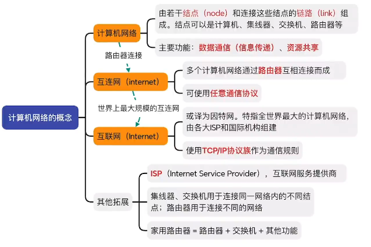
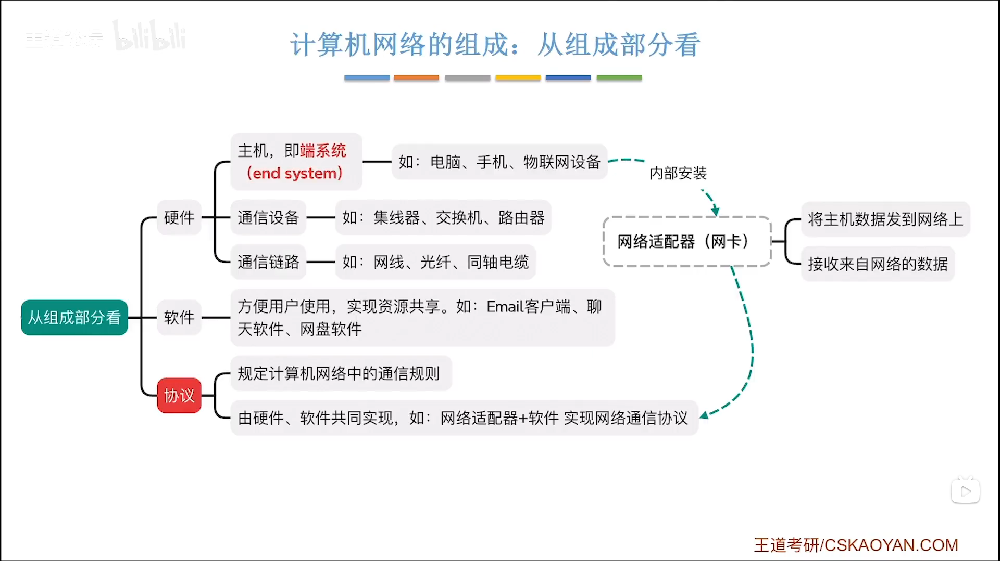

## 计算机网络的概念

### 计算机网络

1. 由若干节点和连接这些节点的链路组成。节点可以是计算机、集线器、交换机等
2. 主要功能：数据通信 (信息传递)、资源共享

### 互连网（个人理解为内网）

1. 多个计算机网络通过路由器相互连接而成
2. 可以使用任意通信协议

### 互联网（个人理解为公网）

1. 特指全世界最大的计算机网络，由各大 ISP 和国际机构组成
2. 使用 TCP/IP 协议族作为通信规则

### 其他拓展

1. ISP，互连网服务提供商
2. 集线器，交换机用于连接同一网络内的不同节点；路由器用于连接不同的网络（注：目前集线器较少使用，因为会产生数据冲突，交换机可以避免这种情况）
3. 家用路由器=路由器+交换机+其他功能

## 计算机网络的组成和功能

### 1. 硬件 

#### (1) 主机：即端系统

如：电脑、手机、物联网设备

#### (2) 通信设备

如：集线器、交换机、路由器

#### (3）通信链路

如：网线、光纤、同轴线缆

### 2. 软件

方便用户的使用，实现资源共享。

如：Email 客户端，聊天软件，网盘软件

### 3. 协议

规定计算机网络中的通信规则，由硬件、软件共同实现

如：网络适配器+软件实现实现网络通信协议

#### 4. 网络适配器(网卡)

1. 将主机数据发送到网络上
2. 接收来自网络的数据

